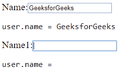

# AngularJS | ng-型号指令

> 原文:[https://www.geeksforgeeks.org/angularjs-ng-model-directive/](https://www.geeksforgeeks.org/angularjs-ng-model-directive/)

**n model**是一个指令，它绑定了输入、选择和文本区域，并将所需的用户值存储在一个变量中，我们可以在任何需要该值的时候使用该变量。
它也在表单验证期间使用。

我们可以将**模型**用于:

1.  投入
    *   文本
    *   检验盒
    *   收音机
    *   数字
    *   电子邮件
    *   全球资源定位器(Uniform Resource Locator)
    *   日期
    *   日期时间-本地
    *   时间
    *   月
    *   周
2.  挑选
3.  文本区域

**示例:**

```
<!DOCTYPE html>
<html>
<script src=
"https://ajax.googleapis.com/ajax/libs/angularjs/1.6.9/angular.min.js">
</script>
<style>
    .column {
        float: left;
        text-align: left;
        width: 49%;
    }

    .row {
        content: "";
        display: table;
    }
</style>

<body ng-app="myApp" 
      ng-controller="myController">
    <h4>Input Box-</h4>
    <div class="row">
        <div class="column">
            Name-
            <input type="text" 
                   ng-model="name">
            <pre>  {{ name }} </pre> Checkbox-
            <input type="checkbox" 
                   ng-model="check">
            <pre> {{ check }} </pre> Radiobox-
            <input type="radio" 
                   ng-model="choice">
            <pre> {{ choice }} </pre> Number-
            <input type="number" 
                   ng-model="num">
            <pre> {{ num }} </pre> Email-
            <input type="email" 
                   ng-model="mail">
            <pre> {{ mail }} </pre> Url-
            <input type="url"
                   ng-model="url">
            <pre> {{ url }} </pre>
        </div>
        <div class="column">
            Date:
            <input type="date" ng-model="date1" (change)="log(date1)">
            <pre> Todays date:{{ date1+1 }}</pre> Datetime-local-
            <input type="datetime-local" ng-model="date2">
            <pre> {{ date2+1 }} </pre> Time-
            <input type="time" ng-model="time1">
            <pre> {{ time1+1 }} </pre> Month-
            <input type="month" ng-model="mon">
            <pre> {{ mon+1 }} </pre> Week-
            <input type="week" ng-model="we">
            <pre> {{ we+1 }} </pre>
        </div>
    </div>
</body>
<script>
    var app = angular.module('myApp', []);
    app.controller('myController', function($scope) {
        $scope.name = "Hello Geeks!";
        $scope.check = "";
        $scope.rad = "";
        $scope.num = "";
        $scope.mail = "";
        $scope.url = "";
        $scope.date1 = "";
        $scope.date2 = "";
        $scope.time1 = "";
        $scope.mon = "";
        $scope.we = "";
        $scope.choice = "";
        $scope.c = function() {
        $scope.choice = true;
        };
    });
</script>

</html>
```


为了使网址和电子邮件打印，我们必须写一个有效的电子邮件/网址，然后它才会得到打印。在使用 ngmodel 打印日期、时间的情况下，我们必须填写输入框中的所有字段。单选按钮一旦被选择就不会被取消选择，因为在**“c”**功能中，我们将选择值设置为真。

**n model 使用表单:**
我们也可以这样定义 n model，

在**app.component.html**写下下面的代码

```
<div class="form-group">
    <label for="phone">mobile</label>
    <form>   
    <input 
          type="text"  
          id="phone" 
          ngModel name="phone"
          #phone="ngModel"
          placeholder="Mobile">
</form>
<pre>{{ phone.value }}</pre>
</div>
```

**n model**通过引用存储变量，而不是值。通常在将输入绑定到对象(例如日期)或集合(例如数组)的模型中。

创建的电话对象有许多字段，用于[验证](https://www.geeksforgeeks.org/angularjs-form-validation/)目的。出于验证目的，我们可以添加以下类。我们只列出重要的。

1.  ng-touch
2.  ng-未触及
3.  ng-有效
4.  ng-无效
5.  肮脏
6.  ng-待定
7.  ng-原始

**用 getter 和 setter 绑定 n model:**
每当用零参数调用函数时，它都会返回模型的表示。当用参数调用时，它设置值。由于 ngModel 引用地址，这就是为什么它不在对象本身中保存已更改的值，而是将其保存在某个内部状态(变量名. value)。当有内部表示时，如果我们保持对模型使用 getter 和 setter 的做法，这将非常有用，因为与代码的其他部分相比，getter 和 setter 函数被调用的频率更高。

**语法:**

```
ng-model-options="{ getterSetter: true }"
```

将此添加到输入选项卡。

**示例:**

```
<html>
<head>
<script src="https://ajax.googleapis.com/ajax/libs/angularjs/1.6.9/angular.min.js">
</script>
</head>
<body ng-app="myApp">
  <div ng-controller="myController">
  <form>
  Name:<input type="text" name="Name"
             ng-model="user.name"
             ng-model-options="{ getterSetter: true }" />
  <pre>user.name = <span ng-bind="user.name()"></span></pre>
  Name1:<input type="text" name="Name1"
             ng-model="user.name1"
             ng-model-options="{ getterSetter: true }" />
  <pre>user.name = <span ng-bind="user.name1()"></span></pre>
  </form>
 </div>
<script>
angular.module('myApp', [])
  .controller('myController', ['$scope', function($scope) {
    name = 'GeeksforGeeks';
    name1 = "";
    $scope.user = {
      name: function(Name) {
      return arguments.length ? (name = Name) : name;
      },
      name1: function(Name1) {
      return arguments.length ? (name1 = Name1) : name1;
      } 
    };
  }]);
</script>
</body>
</html>
```

这里，我们用字符串*初始化名称，用空字符串初始化名称 1 。*



**参考文献:**
[https://docs.angularjs.org/api/ng/directive/ngModel](https://docs.angularjs.org/api/ng/directive/ngModel)