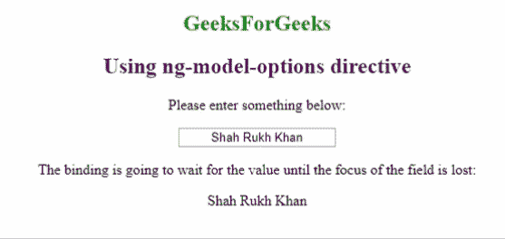

# AngularJS | ng-型号选项指令

> 原文:[https://www . geeksforgeeks . org/angular js-ng-model-options-direction/](https://www.geeksforgeeks.org/angularjs-ng-model-options-directive/)

**ng-model-options** 指令具有帮助用户在当前应用程序中修改 ngModel 指令行为的功能。基本上，当用户必须控制范围内的变量和 HTML 表单元素的绑定时，就会用到它。
您还可以指定绑定发生的等待时间。它可以被编程为花费一些时间，或者几乎可以立即完成(如下例所示)。

**语法:**

```
<element ng-model-options="option"> </element>
```

**语法支持:**

*   <input>
*   <textarea></li></ul><p><strong>参数:</strong></p><ul><strong>option:</strong> An object specifying the options must be followed by the data-binding.</ul><li>{updateOn: 'event'}指定绑定应该在特定事件发生时发生。</li><li>{去抖:1000}以毫秒为单位指定绑定的等待时间。</li><li>{allowInvalid : true|false}指定如果值未通过验证，是否会发生绑定。</li><li>{getterSetter : true|false}指定绑定到模型的函数是否应被视为 getterSetter。</li><li>{timezone : ‘0100’} Specifies what timezone should be used when working with the Date object.<p><strong>示例:</strong>本示例将讲述如何通过 ng-model-options 指令保持输入字段值的数据绑定，直到字段的焦点丢失。<br/>您还会注意到，当您输入某个内容时，该值会立即更新。</p><pre><!DOCTYPE html>    <html>    <script src=" https://ajax.googleapis.com/ajax/libs/angularjs/1.6.9/angular.min.js"> </script>    <body style="text-align:center">        <h2 style="color:green">           GeeksForGeeks       </h2>     <h2 style="color:purple">           Using ng-model-options directive       </h2>        <div ng-app="myApp"           ng-controller="myCtrl">                  <p>Please enter something below:</p>                  <input ng-model="name"                 ng-model-options="{                             updateOn: 'default blur',                             debounce: { default: 500, blur: 0 } }"                 style="text-align:center">            <p>The binding is going to wait for           the value until the focus of the            field is lost:</p>{{name}}</div>        <script>         var app = angular.module('myApp', []);         app.controller('myCtrl', function($scope) {             $scope.name = "Shah Rukh Khan";         });     </script>    </body>    </html></pre><p><strong>输出:</strong> <br/> </p><br/><br/><br/></li> </body></html></textarea>