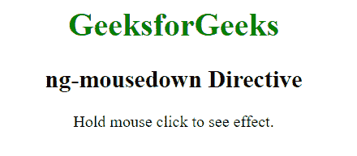
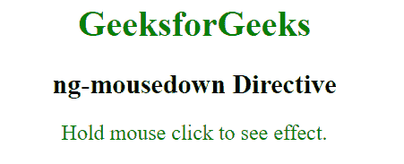
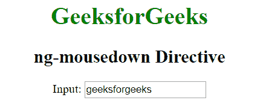
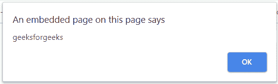

# angolajs | ng-mousedown 指令

> 原文:[https://www . geeksforgeeks . org/angular js-ng-mouse down-direction/](https://www.geeksforgeeks.org/angularjs-ng-mousedown-directive/)

AngularJS 中的 **ng-mousedown 指令**用于在特定的 HTML 元素上发生 mousedown 事件时应用自定义行为。当按下鼠标按钮时，它可以用来显示弹出警告。所有 HTML 元素都支持它。

**语法:**

```ts
 <element ng-mousedown="expression"> Contents... </element> 
```

**示例 1:** 本示例使用 ng-mousedown 指令在单击鼠标后设置元素的样式。

```ts
<!DOCTYPE html>
<html>

<head>
    <script src=
"https://ajax.googleapis.com/ajax/libs/angularjs/1.6.9/angular.min.js">
    </script>

    <title>ng-mousedown Directive</title>
</head>

<body ng-app style="text-align:center">

    <h1 style="color:green">GeeksforGeeks</h1>

    <h2>ng-mousedown Directive</h2>

    <div>
        <p ng-mousedown="geek={'color':'green',
                'font-size':'larger'}" ng-mouseup=
                "geek={'font-size':''}" ng-style="geek"
                ng-class="'button'">
            Hold mouse click to see effect.
        </p>
    </div>
</body>

</html>
```

**输出:**
**点击元素前:**

**点击元素后:**


**示例 2:** 本示例使用 ng-mousedown Directive 在点击输入区域后显示提醒消息。

```ts
<!DOCTYPE html>
<html>

<head>
    <script src=
"https://ajax.googleapis.com/ajax/libs/angularjs/1.6.9/angular.min.js">
    </script>

    <title>ng-mousedown Directive</title>
</head>

<body  ng-app="app" style="text-align:center">

    <h1 style="color:green">GeeksforGeeks</h1>

    <h2>ng-mousedown Directive</h2>

    <div ng-controller="app">
        Input: <input type="text" ng-mousedown="alert()"
            ng-model="click" />
    </div>

    <script>
        var app = angular.module("app", []);
        app.controller('app', ['$scope', function ($scope) {
            $scope.click = 'geeksforgeeks';
            $scope.alert = function () {
                alert($scope.click);
            }
        }]);
    </script>
</body>

</html>
```

**输出:**
**点击前输入文字:**

**点击后输入文字:**
