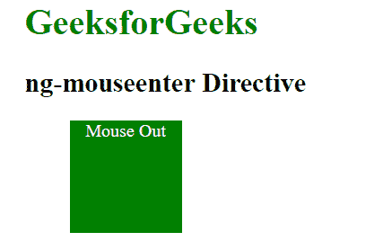
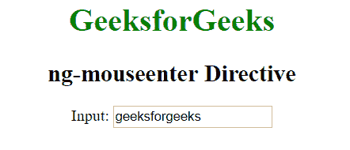
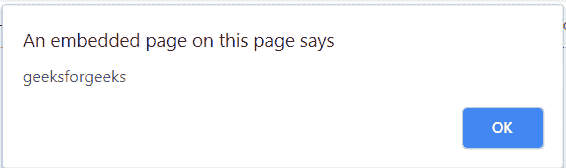

# 角联| ng-mouseter 指令

> 哎哎哎:# t0]https://www . geeksforgeeks . org/angolajs-ng-mousenier-directive/

AngularJS 中的 ng-mouseenter 指令用于在特定的 HTML 元素上发生鼠标输入事件时应用自定义行为。当鼠标进入 HTML 元素中的特定位置时，它可以用来显示弹出警告。所有 HTML 元素都支持它。

**语法:**

```
 <element ng-mouseenter="expression"> content ... </element> 
```

**例 1:**

```
<!DOCTYPE html>
<html>
    <script src="https://ajax.googleapis.com/ajax/libs/angularjs/1.6.9/
    angular.min.js"></script>
    <head>
        <title>ng-mouseenter Directive</title>
        </head>
    <style type="text/css">
        .outerDiv {
            width: 100px;
            height: 100px;
            background-color: green;
            margin-left:40px;
        }
    </style>
    <body ng-app style="padding:30px">
            <h1 style="color:green">GeeksforGeeks</h1>
            <h2>ng-mouseenter Directive</h2>
            <div class="outerDiv" ng-mouseenter="oc=oc+1;outer=true" 
                ng-mouseleave="outer=false">
                <p style="text-align:center;color:white">Mouse 
                     {{outer==true?'Enter':'Out'}}</p>
                <br />

                <p style="text-align:center;color:white">
               {{oc}}<br /></p>
            </div>
    </body>
</html>
```

**输出:**
**鼠标进入前:**

**鼠标进入后:**


**例 2:**

```
<!DOCTYPE html>
<html>
    <script src="https://ajax.googleapis.com/ajax/libs/angularjs/1.6.9/
    angular.min.js"></script>
    <head>
        <title>ng-mouseenter Directive</title>
       </head>
     <body  ng-app="app" style="text-align:center">
        <h1 style="color:green">GeeksforGeeks</h1>
        <h2>ng-mouseenter Directive</h2>

        <div ng-controller="app">
            Input: <input type="text" ng-mouseenter="alert()" 
                ng-model="click" />
        </div>
        <script>
            var app = angular.module("app", []);
            app.controller('app', ['$scope', function ($scope) {
                $scope.click = 'geeksforgeeks';
                $scope.alert = function () {
                    alert($scope.click);
                }
            }]);
        </script>
    </body>
</html>
```

**输出:**
**鼠标进入前:**

**鼠标进入后:**
