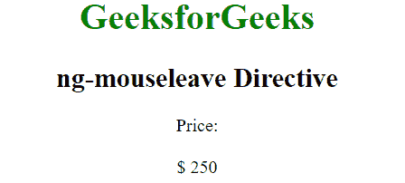

# angolajs | ng-moueleve 指令

> 原文:[https://www . geeksforgeeks . org/angular js-ng-mouseleave-direction/](https://www.geeksforgeeks.org/angularjs-ng-mouseleave-directive/)

AngularJS 中的 ng-mouseleave 指令用于在特定的 HTML 元素上发生鼠标离开事件时应用自定义行为。当鼠标离开 HTML 元素中的特定位置时，它可以用来显示弹出警告。所有 HTML 元素都支持它。
**语法:**

```
 <element ng-mouseleave="expression"> content ... </element> 
```

**例 1:**

## 超文本标记语言

```
<!DOCTYPE html>
<html>
    <script src="https://ajax.googleapis.com/ajax/libs/angularjs/
    1.6.9/angular.min.js"></script>
    <head>
        <title>ng-mouseleave Directive</title>
    </head>
    <body ng-app="" style="text-align: center">
        <h1 style="color:green">GeeksforGeeks</h1>
        <h2>ng-mouseleave Directive</h2>
        <div>price :</div>
        <div ng-hide="leave" ng-mouseenter="leave=true"><span
        class="amount">$ {{price}}</span></div>
        <div ng-show="leave" ng-mouseleave="leave=false">
            <input type="number" class="form-control"
            ng-model="price" ng-init="price=250" />
        </div>
    </body>
</html>
```

**输出:**
**鼠标离开前:**


**老鼠离开后:**



**例 2:**

## 超文本标记语言

```
<!DOCTYPE html>
<html>
    <script src="https://ajax.googleapis.com/ajax/libs/angularjs/
    1.6.9/angular.min.js"></script>
    <head>
        <title>ng-mouseleave Directive</title>
       </head>
     <body  ng-app="app" style="text-align:center">
        <h1 style="color:green">GeeksforGeeks</h1>
        <h2>ng-mouseleave Directive</h2>

        <div ng-controller="app">
            Input: <input type="text" ng-mouseleave="alert()"
                ng-model="click" />
        </div>
        <script>
            var app = angular.module("app", []);
            app.controller('app', ['$scope', function ($scope) {
                $scope.click = 'geeksforgeeks';
                $scope.alert = function () {
                    alert($scope.click);
                }
            }]);
        </script>
    </body>
</html>
```

**输出:**
**鼠标离开前:**


**老鼠离开后:**

