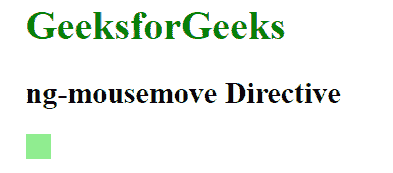
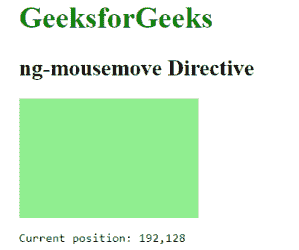
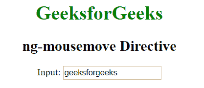
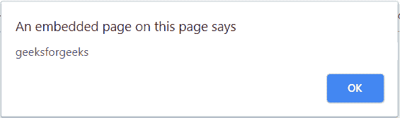

# 角联| ng-mousemove 指令

> 哎哎哎:# t0]https://www . geeksforgeeks . org/angolajs-ng-mousemove-directive/

AngularJS 中的 **ng-mousemove 指令**用于在特定的 HTML 元素上发生 mousemove 事件时应用自定义行为。当鼠标移动到特定的 HTML 元素上时，它可以用来显示弹出警告。所有 HTML 元素都支持它。

**语法:**

```
<element ng-mousemove="expression"> Contents... </element>
```

**示例 1:** 本示例使用 ng-mousemove 指令更改 CSS 样式。

```
<!DOCTYPE html>
<html>

<head>
    <title>ng-mousemove Directive</title>

    <script src=
"https://ajax.googleapis.com/ajax/libs/angularjs/1.6.9/angular.min.js">
    </script>
</head>

<body ng-app="app" style="padding-left:30px;">

    <h1 style="color:green">GeeksforGeeks</h1>

    <h2>ng-mousemove Directive</h2>

    <div ng-controller="geek">
        <div style="height:20px;width:20px; " ng-style=
                "{'backgroundColor':'lightgreen', width:X+'px',
                height:Y+'px' }" ng-mousemove="down($event)"></div>

        <pre ng-show="X">Current position: {{X}}, {{Y}}</pre>
    </div>

    <script>
        var app = angular.module("app", []);
        app.controller('geek', ['$scope', function ($scope) {
            $scope.down = function (event) {
                $scope.X = event.clientX;
                $scope.Y = event.clientY;
            };
        }]);
    </script>
</body>

</html>
```

**输出:**
**鼠标移动元素前:**

**鼠标移动元素后:**


**示例 2:** 本示例使用 ng-mousemove 指令显示警报消息。

```
<!DOCTYPE html>
<html>

<head>
    <title>ng-mousemove Directive</title>

    <script src=
"https://ajax.googleapis.com/ajax/libs/angularjs/1.6.9/angular.min.js">
    </script>
</head>

<body  ng-app="app" style="text-align:center">

    <h1 style="color:green">GeeksforGeeks</h1>
    <h2>ng-mousemove Directive</h2>

    <div ng-controller="app">
        Input: <input type="text" ng-mouseleave="alert()"
                ng-model="click" />
    </div>

    <script>
        var app = angular.module("app", []);
        app.controller('app', ['$scope', function ($scope) {
            $scope.click = 'geeksforgeeks';
            $scope.alert = function () {
                alert($scope.click);
            }
        }]);
    </script>
</body>

</html>
```

**输出:**
**鼠标移动前输入元素:**

**鼠标移动后输入元素:**
