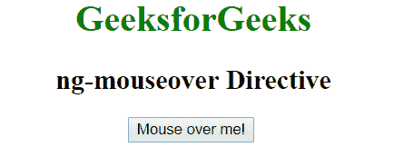
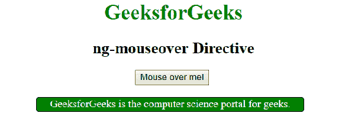
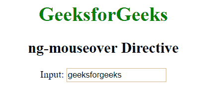
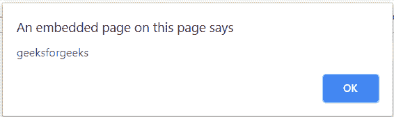

# AngularJS | ng-鼠标悬停指令

> 原文:[https://www . geeksforgeeks . org/angular js-ng-mouse over-direction/](https://www.geeksforgeeks.org/angularjs-ng-mouseover-directive/)

AngularJS 中的 **ng-mouseover 指令**用于在特定的 HTML 元素上发生鼠标悬停事件时应用自定义行为。当鼠标在特定元素上移动时，它可以用来显示弹出警告。所有 HTML 元素都支持它。

**语法:**

```
<element ng-mouseover="expression"> Contents... </element>
```

**示例 1:** 本示例使用 ng-mouseover Directive 在鼠标移动到元素上时显示内容。

```
<!DOCTYPE html>
<html>

<head>
    <title>ng-mouseover Directive</title>

    <script src=
"https://ajax.googleapis.com/ajax/libs/angularjs/1.6.9/angular.min.js">
    </script>

    <style type="text/css">
        .geek {
            border: 1px solid black;
            width: 400px;
            background-color: green;
            border-radius: 4px;
            height: 20px;
            color: white;
        }
    </style>
</head>

<body ng-app="">
    <center>
        <h1 style="color:green">
            GeeksforGeeks
        </h1>

        <h2>ng-mouseover Directive</h2>

        <div ng-init="geek=false">

            <button ng-mouseover="geek=true" 
                    ng-mouseleave="geek=false">
                Mouse over me!
            </button>

            <br><br>

            <div class="geek" ng-show="geek">
                GeeksforGeeks is the computer 
                science portal for geeks.
            </div>
        </div>
    </center>
</body>

</html>
```

**输出:**
**鼠标悬停元素前:**

**鼠标悬停元素后:**


**示例 2:** 本示例使用 ng-mouseover Directive 在鼠标移动到元素上时显示警告消息。

```
<!DOCTYPE html>
<html>

<head>
    <title>ng-mouseover Directive</title>

    <script src=
"https://ajax.googleapis.com/ajax/libs/angularjs/1.6.9/angular.min.js">
    </script>
</head>

<body  ng-app="app" style="text-align:center">

    <h1 style="color:green">GeeksforGeeks</h1>
    <h2>ng-mouseover Directive</h2>

    <div ng-controller="app">
        Input: <input type="text" ng-mouseover="alert()"
                ng-model="click" />
    </div>

    <script>
        var app = angular.module("app", []);
        app.controller('app', ['$scope', function ($scope) {
            $scope.click = 'geeksforgeeks';
            $scope.alert = function () {
                alert($scope.click);
            }
        }]);
    </script>
</body>

</html>
```

**输出:**
**鼠标悬停元素前:**

**鼠标悬停元素后:**
