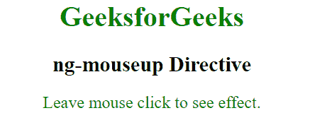
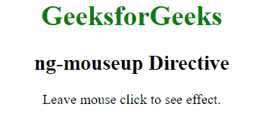
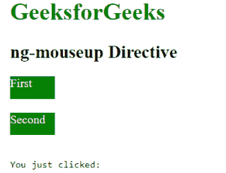
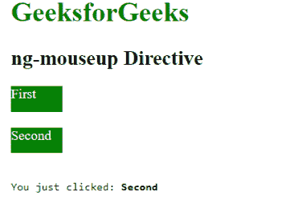

# angolajs | ng-mouseup 指令

> 原文:[https://www . geeksforgeeks . org/angular js-ng-mouseup-direction/](https://www.geeksforgeeks.org/angularjs-ng-mouseup-directive/)

AngularJS 中的 **ng-mouseup 指令**用于在特定的 HTML 元素上发生 mouseup 事件时应用自定义行为。当按下鼠标按钮时，它可以用来显示弹出警告。所有 HTML 元素都支持它。

**语法:**

```ts
 <element ng-mouseup="expression"> Contents... </element> 
```

**示例 1:** 本示例使用 ng-mouseup 指令更改文本效果。

```ts
<!DOCTYPE html>
<html>

<head>
    <script src=
"https://ajax.googleapis.com/ajax/libs/angularjs/1.6.9/angular.min.js">
    </script>

    <title>ng-mouseup Directive</title>
</head>

<body ng-app style="text-align:center">

    <h1 style="color:green">GeeksforGeeks</h1>

    <h2>ng-mouseup Directive</h2>

    <div>
        <p ng-mouseup="geek={'color':'green',
            'font-size':'larger'}"
            ng-mousedown="geek={'font-size':''}" 
            ng-style="geek" ng-class="'button'">
            Hold mouse click to see effect.
        </p>
    </div>
</body>

</html>
```

**输出:**
**离开元素后:**

**点击元素后:**


**示例 2:** 本示例使用 ng-mouseup 指令显示数组元素。

```ts
<!DOCTYPE html>
<html>

<head>
    <script src=
"https://ajax.googleapis.com/ajax/libs/angularjs/1.6.9/angular.min.js">
    </script>

    <title>ng-mouseup Directive</title>
</head>

<body  ng-app="app" style="padding:20px">

    <h1 style="color:green">GeeksforGeeks</h1>

    <h2>ng-mouseup Directive</h2>

    <div ng-controller="app">
        <div ng-repeat="p in array">
            <div style="background-color:green;color:white;
                height:30px;width:10%" ng-mouseup="mouseOver(p)">
                {{p}}
            </div><br>
        </div>

        <pre>You just clicked: <b>{{input}}</b></pre>
    </div>

    <script>
        var app = angular.module("app", []);
        app.controller('app', ['$scope', function ($scope)
        {
            $scope.mouseOver = function (data) {
                $scope.input = data;
            };
        $scope.array = ["First", "Second"]
        }]);
    </script>
</body>

</html>
```

**输出:**
**点击元素前:**

**点击元素后:**
