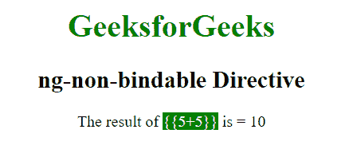
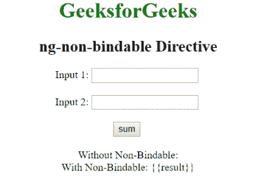
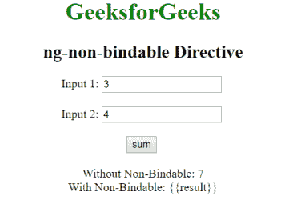

# 不可装订指令

> 原文:[https://www . geeksforgeeks . org/angularjs-ng-不可绑定-指令/](https://www.geeksforgeeks.org/angularjs-ng-non-bindable-directive/)

AngularJS 中的**ng-不可绑定指令**用于指定 HTML 的特定内容不应该被编译，即内容应该被 AngularJS 忽略。当我们想要显示代码片段而不是编译输出时，可以使用它。

**语法:**

```ts
<element ng-non-bindable> Contents... </element> 
```

**示例 1:** 本示例使用 ng-不可绑定指令忽略表达式。

```ts
<!DOCTYPE html>
<html>

<head>
    <title>ng-non-bindable Directive</title>

    <script src=
    "https://ajax.googleapis.com/ajax/libs/angularjs/1.6.9/angular.min.js">
    </script>
</head>

<body ng-app="" style="text-align: center">

    <h1 style="color:green">GeeksforGeeks</h1>
    <h2>ng-non-bindable Directive</h2>                             

    <div>
        The result of <span style="background-color:green;color:white"
            ng-non-bindable>{{5+5}}</span> is = {{5+5}} 
    </div> 
</body>

</html>                    
```

**输出:**


**示例 2:** 本示例使用 ng-不可绑定指令忽略表达式。

```ts
<!DOCTYPE html>
<html>

<head>
    <title>ng-non-bindable Directive</title>

    <script src=
"https://ajax.googleapis.com/ajax/libs/angularjs/1.6.9/angular.min.js">
    </script>
</head>

<body ng-app="app" style="text-align: center">

    <h1 style="color:green">GeeksforGeeks</h1>
    <h2>ng-non-bindable Directive</h2>                             

    <div ng-controller="geek">
        Input 1: <input type="number" ng-model="val1" />
        <br><br>
        Input 2: <input type="number" ng-model="val2" />
        <br><br>
        <input type="button" value="sum" ng-click="sum()" />
        <br><br>
        <div>Without Non-Bindable: {{result}}</div>
        <div ng-non-bindable>With Non-Bindable: {{result}}</div>
    </div>

    <script>
        var app = angular.module("app", []);
        app.controller('geek', ['$scope', function ($scope) {
            $scope.sum = function () {
                $scope.result = $scope.val1 + $scope.val2;
            }
        }]);
    </script>
</body>

</html>                    
```

**输出:**
**点击前:**

**点击后:**
