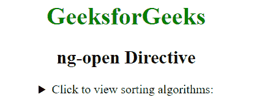
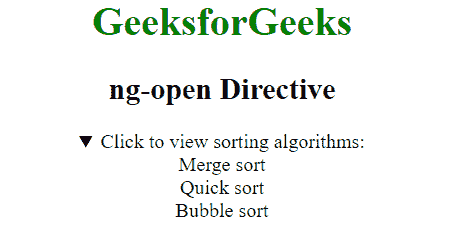

# AngularJS | ng-open 指令

> 原文:[https://www.geeksforgeeks.org/angularjs-ng-open-directive/](https://www.geeksforgeeks.org/angularjs-ng-open-directive/)

AngularJS 中的 **ng-open 指令**用于指定指定 HTML 元素的 open 属性。如果 ng-open 指令中的表达式返回 true，那么将显示细节，否则将隐藏细节。

**语法:**

```ts
<element ng-open="expression"> Contents... <element>
```

**示例:**本示例使用 ng-open 指令打开元素的属性。

```ts
<!DOCTYPE html>
<html>

<head>
    <title>ng-open Directive</title>

    <script src=
"https://ajax.googleapis.com/ajax/libs/angularjs/1.6.9/angular.min.js">
    </script>
</head>

<body ng-app="" style="text-align: center">

    <h1 style="color:green">GeeksforGeeks</h1>
    <h2>ng-open Directive</h2>                             

    <details id="details" ng-open="open">
        <summary>Click to view sorting algorithms:</summary>
        <summary>Merge sort</summary>
        <summary>Quick sort</summary>
        <summary>Bubble sort</summary>
    </details>
</body>

</html>                    
```

**输出:**
**点击元素前:**

**点击元素后:**
