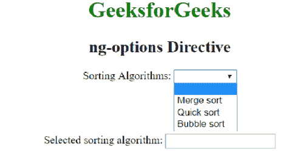
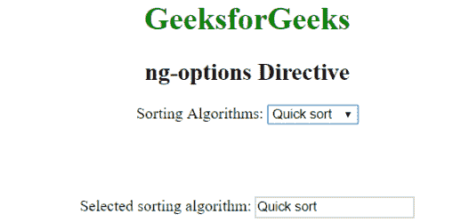
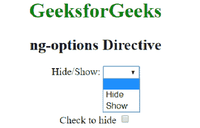
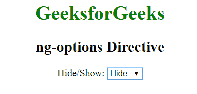

# AngularJS | ng-选项指令

> 原文:[https://www . geeksforgeeks . org/angular js-ng-options-direction/](https://www.geeksforgeeks.org/angularjs-ng-options-directive/)

AngularJS 中的 **ng-options 指令**用于构建带有选项的 HTML 元素并将其绑定到模型属性。用于在<选择>列表中指定<选项>。它是专门为填充下拉列表的项目而设计的。由<支撑的>元件支撑。

**语法:**

```
<element ng-options="expression"> Content ... </element> 

```

**示例 1:** 本示例使用 ng-options direction 显示选项元素。

```
<!DOCTYPE html>
<html>

<head>
    <title>ng-options Directive</title>

    <script src=
"https://ajax.googleapis.com/ajax/libs/angularjs/1.6.9/angular.min.js">
    </script>
</head>

<body ng-app="app" style="text-align: center">

    <h1 style="color:green">GeeksforGeeks</h1>
    <h2>ng-options Directive</h2>                             

    <div ng-controller="geek" ng-init="StudentId=1">
        Sorting Algorithms: 
        <select ng-model="Sorting" ng-options="sort.name as 
            sort.name for sort in sorting"></select>

        <br><br><br><br><br>

        Selected sorting algorithm: 
        <input type="text" ng-model="Sorting" />
    </div>

    <script>
        var app = angular.module("app", []);
        app.controller('geek', ['$scope', function ($scope) {
            $scope.sorting = [
                { name: 'Merge sort', id: 1 }, 
                { name: 'Quick sort', id: 2 }, 
                { name: 'Bubble sort', id: 3 }
            ];
        }]);
    </script>
</body>

</html>                    
```

**输出:**
**选择元素前:**

**选择元素后:**


**示例 2:** 本示例使用 ng-options 指令隐藏或显示元素。

```
<!DOCTYPE html>
<html>

<head>
    <title>ng-options Directive</title>

    <script src=
    "https://ajax.googleapis.com/ajax/libs/angularjs/1.6.9/angular.min.js">
    </script>
</head>

<body ng-app="app" style="text-align: center">

    <h1 style="color:green">GeeksforGeeks</h1>
    <h2>ng-options Directive</h2>                               

    <div ng-controller="geek" ng-init="Id=1">
        Choose: <select ng-model="hide" ng-options="show.hide
            as show.name for show in HideShow"></select>

        <br><br><br>

        <span ng-hide="hide"> 
            Check to hide <input type="checkbox"
                    ng-model="hide" />
        </span>
    </div>

    <script>
        var app = angular.module("app", []);
        app.controller('geek', ['$scope', function ($scope) {
            $scope.HideShow = [
                { name: 'Hide', hide: true, }, 
                { name: 'Show', hide: false }
            ];
        }]);
    </script>
</body>

</html>
```

**输出:**
**选择隐藏元素前:**

**选择隐藏元素后:**
