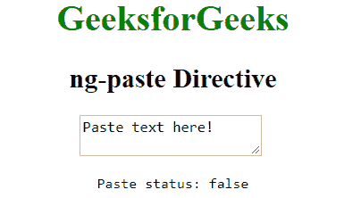
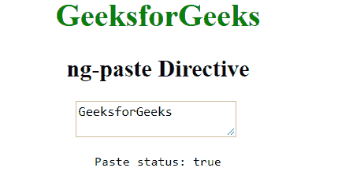

# AngularJS | ng-粘贴指令

> 原文:[https://www.geeksforgeeks.org/angularjs-ng-paste-directive/](https://www.geeksforgeeks.org/angularjs-ng-paste-directive/)

AngularJS 中的 **ng-paste 指令**用于在将输入字段中的文本粘贴到 HTML 元素中时指定自定义行为函数。它可以用来调用一个函数，当文本粘贴到输入字段时，该函数将被触发。通过<输入>、<选择>和<文本区>支持。
**语法:**

```ts
 <element ng-paste="expression"> Content ... </element> 

```

其中**表达式**告诉当输入被粘贴到一个 HTML 元素中时要做什么。
T3】例:

```ts
<!DOCTYPE html>
<html>
    <head>
        <title>ng-paste Directive</title>
        <script src=
 "https://ajax.googleapis.com/ajax/libs/angularjs/1.4.2/angular.min.js">
        </script>
    </head>
    <body ng-app  style="text-align:center">
        <h1 style="color:green">GeeksforGeeks</h1>
        <h2>ng-paste Directive</h2>
        <div ng-init="ispaste=false;paste='Paste some text!'">
            <textarea ng-paste="ispaste=true" ng-model="paste">
            </textarea>
            <br />
            <pre>Paste status: {{ispaste}}</pre>
        </div>
    </body>

</html>
```

**输出:**
**前贴:**

**后贴:**
