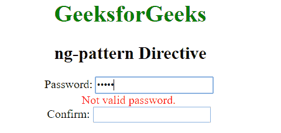
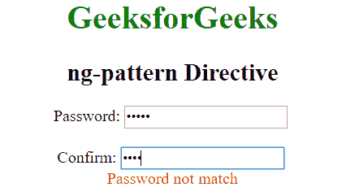
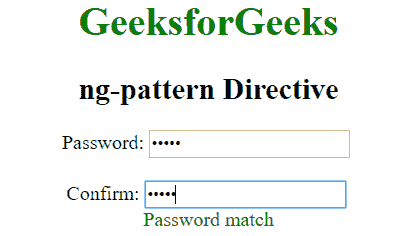
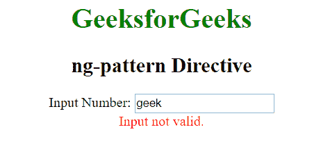
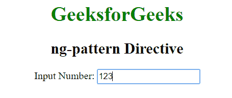

# 角度模式指令

> 原文:[https://www . geeksforgeeks . org/angularjs-ng-pattern-directive/](https://www.geeksforgeeks.org/angularjs-ng-pattern-directive/)

AngularJS 中的 **ng-pattern 指令**用于将模式(正则表达式模式)验证器添加到输入 HTML 元素的 ngModel 中。如果输入字段数据与通过评估 ngpattern 属性值中指定的 Angular 表达式找到的 RegExp 不匹配，则使用它来设置模式验证错误键。

**语法:**

```
<element ng-pattern="expression"> Contents... </element>
```

**示例 1:** 本示例使用 ng-pattern Directive 检查密码模式。

```
<!DOCTYPE html>
<html>

<head>
    <title>ng-pattern Directive</title>

    <script src=
"https://ajax.googleapis.com/ajax/libs/angularjs/1.4.2/angular.min.js">
    </script> 

    <style>
        .red {
            color:red
        }
        .green {
            color:green
        }
    </style>
</head>

<body ng-app="app" style="text-align:center">

    <h1 style="color:green;">GeeksforGeeks</h1>
    <h2 style="">ng-pattern Directive</h2>

    <div ng-controller="geek">
        <ng-form name="pass">
            Password:<input type="password" ng-model="password"
                name="password" ng-pattern="re" /><br>

            <span ng-show="pass.password.$error.pattern" 
                    style="color:red">
                Not valid password.
            </span><br>

            Confirm: <input type="password" ng-model="repass"
                    ng-keyup="compare(repass)" name="repass"
                    ng-pattern="re" /><br>

            <span ng-show="isconfirm || pass.repass.$dirty "
                ng-class="{true:'green',false:'red'}[isconfirm]">
                Password {{isconfirm==true?'':'not'}} match
            </span>
        </ng-form>
    </div>

    <script>
        var app = angular.module("app", []);
        app.controller('geek', ['$scope', function ($scope) {
            $scope.re = /^[a-zA-Z]\w{3,14}$/;

            $scope.compare = function (repass) {
                $scope.isconfirm = $scope.password == repass ?
                        true : false;
            }
        }]);
    </script>
</body>

</html>                    
```

**输出:**

*   **无效输入:**
    
*   **输入不匹配:**
    
*   **有效输入:**
    

**示例 2:** 如果输入不是数字，则本示例显示错误。

```
<!DOCTYPE html>
<html>

<head>
    <title>ng-pattern Directive</title>

    <script src=
"https://ajax.googleapis.com/ajax/libs/angularjs/1.4.2/angular.min.js">
    </script> 
</head>

<body ng-app="app" style="text-align:center">

    <h1 style="color:green;">GeeksforGeeks</h1>
    <h2 style="">ng-pattern Directive</h2>

    <div ng-controller="geek">
        <ng-form name="num">
            Input Number: <input type="text" ng-model="number"
                name="number" ng-pattern="re" /><br />

            <span ng-show="num.number.$error.pattern" style="color:red">
                Input is not valid.
            </span>
        </ng-form>
    </div>

    <script>
        var app = angular.module("app", []);

        app.controller('geek', ['$scope', function ($scope) {
            $scope.re = /^[0-9]{1,6}$/;
        }]);
    </script>
</body>

</html>                    
```

**输出:**

*   **输入的是文字:**
    
*   **输入的是数字:**
    