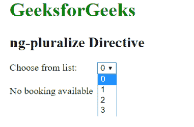
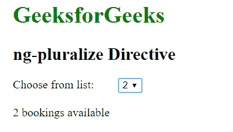
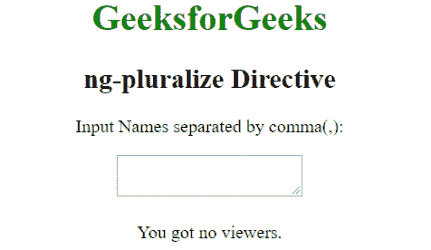
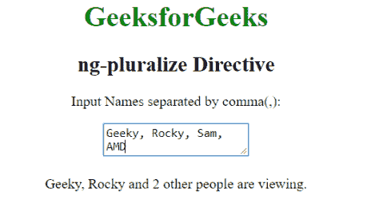

# AngularJS | ng-复数指令

> 原文:[https://www . geeksforgeeks . org/angularjs-ng-multipleze-direction/](https://www.geeksforgeeks.org/angularjs-ng-pluralize-directive/)

AngularJS 中的**ng-multiplex 指令**用于根据 en-us 本地化规则指定要显示的消息。en-us 本地化规则与 AngularJS 捆绑在一起。AngularJS 中默认的复数类别是“一”和“其他”。

**语法:**

```ts
<ng-pluralize count="" when="string" [offset="number"]>
Contents...
</ng-pluralize>

```

**参数值:**

*   **计数:**指 Angular 表达式使用的计数属性值。
*   **when:** 用于指定实际字符串和复数类别之间的映射。属性值必须是 JSON 对象样式。
*   **偏移量:**指定从总数中扣除的偏移量属性。

**示例 1:** 本示例使用 ng-multiplex Directive 显示内容。

```ts
<!DOCTYPE html>
<html>

<head>
    <title>ng-pluralize Directive</title>

    <script src=
"https://ajax.googleapis.com/ajax/libs/angularjs/1.4.2/angular.min.js">
    </script> 
</head>

<body ng-app="app" style="padding:20px">

    <h1 style="color:green;">GeeksforGeeks</h1>
    <h2 style="">ng-pluralize Directive</h2>

    <div ng-controller="geek">
        <div ng-init="Hotel=[0, 1, 2, 3]">
            Choose from list: 
            <select ng-model="booking" ng-options=
                "booking as booking for booking in Hotel">
            </select>

            <br><br> 

            <ng-pluralize count="booking" when="{
                    '0':'No booking available',
                    '1':'{{booking}} booking available',
                    '2':'{{booking}} bookings available',
                    '3':'{{booking}} bookings available',
                    }">
            </ng-pluralize>
        </div>
    </div>

    <script>
        var app = angular.module("app", []);
        app.controller('geek', ['$scope', function ($scope) {
            $scope.booking = 0;
        }]);
    </script>
</body>

</html>                    
```

**输出:**
**选择元素前:**

**选择元素后:**


**示例 2:** 本示例使用 ng-multiplex Directive 显示输入的文本内容。

```ts
<!DOCTYPE html>
<html>

<head>
    <title>ng-pluralize Directive</title>

    <script src=
"https://ajax.googleapis.com/ajax/libs/angularjs/1.4.2/angular.min.js">
    </script> 
</head>

<body ng-app="app" style="text-align:center">

    <h1 style="color:green;">GeeksforGeeks</h1>
    <h2 style="">ng-pluralize Directive</h2>

    <div ng-controller="geek">
        <p>Input Names separated by comma(, ):</p>
        <textarea class="form-control" ng-model="people"
            ng-list=", "></textarea>

        <br><br>

        <ng-pluralize count="people.length" offset="2" when="{
                '0': 'You got no viewers.',
                '1': '{{people[0]}} is viewing.',
                '2': '{{people[0]}} and {{people[1]}} are viewing.',
                'one': '{{people[0]}}, {{people[1]}} and one other
                        person is viewing.',
                'other': '{{people[0]}}, {{people[1]}} and {}
                        other people are viewing.'}">
            </ng-pluralize>
    </div>

    <script>
        var app = angular.module("app", []);
        app.controller('geek', ['$scope', function ($scope) {
            $scope.people = [];
        }]);
    </script>
</body>

</html>
```

**输出:**
**输入文本前:**

**输入文本后:**
