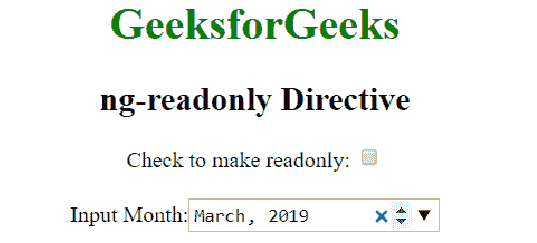

# AngularJS | ng-只读指令

> 原文:[https://www . geeksforgeeks . org/angular js-ng-readonly-directive/](https://www.geeksforgeeks.org/angularjs-ng-readonly-directive/)

AngularJS 中的 **ng-readonly 指令**用于指定一个 HTML 元素的 readonly 属性。只有当 ng-readonly 指令中的表达式返回 true 时，HTML 元素才是只读的。

**语法:**

```ts
<element ng-readonly="expression"> Contents... </element> 
```

**示例 1:** 本示例使用 ng-readonly 指令来启用 readonly 属性。

```ts
<!DOCTYPE html>
<html>
    <head>
        <title>ng-readonly Directive</title>

        <script src=
"https://ajax.googleapis.com/ajax/libs/angularjs/1.4.2/angular.min.js">
        </script>
    </head>

    <body ng-app style="text-align:center">
        <h1 style="color:green">GeeksforGeeks</h1>
        <h2>ng-readonly Directive</h2>

        <div>
            <label>Check to make month readonly: <input type="checkbox"
            ng-model="open"></label>

            <br><br>

            Input Month:<input ng-readonly="open" type="month"
                    ng-model="month">
        </div>
    </body>
</html>                    
```

**输出:**
**之前勾选了复选框:**

**之后勾选了复选框:**


**示例 2:** 本示例使用 ng-readonly 指令来启用选项列表中的 readonly 属性。

```ts
<!DOCTYPE html>
<html>
    <head>
        <title>ng-readonly Directive</title>

        <script src=
"https://ajax.googleapis.com/ajax/libs/angularjs/1.4.2/angular.min.js">
        </script>
    </head>

    <body ng-app="app" style="text-align:center">
        <h1 style="color:green">GeeksforGeeks</h1>
        <h2>ng-readonly Directive</h2>
        <div ng-controller="geek">
            <div >
                <button ng-click="edit=true">Edit</button>
                <button ng-init="edit=false" ng-click="edit=false">
                    Update
                </button>                 
            </div>
            <br>

            <div>Select sorting algorithm</div><br>

            <div><select class="form-control" ng-disabled="!edit"
                    ng-init="status=1" ng-model="status"
                    ng-options="s.id as s.set for s in set">
                </select>
            </div>
        </div>

        <script>
            var app = angular.module("app", []);
            app.controller('geek', ['$scope', function ($scope) {
                $scope.set = [{ id: 1, set: 'Merge sort' },
                    { id: 2, set: 'Quick sort' },
                    { id: 3, set: 'Bubble sort' }];
            }]);
        </script>
    </body>
</html>                    
```

**输出:**
**点击编辑按钮:**

**点击更新按钮:**
