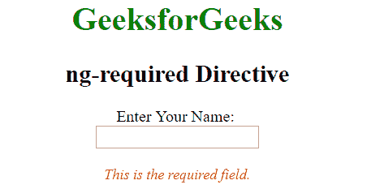
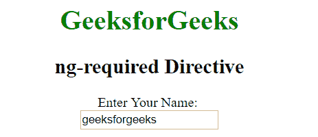
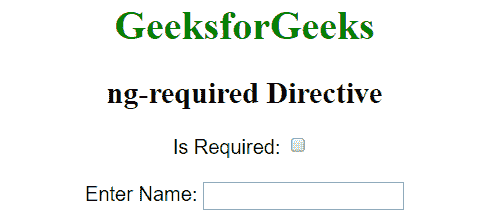

# AngularJS | ng-必需指令

> 原文:[https://www . geeksforgeeks . org/angularjs-ng-required-direction/](https://www.geeksforgeeks.org/angularjs-ng-required-directive/)

AngularJS 中的 **ng-required 指令**用于指定 HTML 元素所需的属性。只有当 ng-required 指令中的表达式返回 true 时，表单中的输入字段才是必需的。通过<输入>、<选择>和<文本区>进行支持。

**语法:**

```
<element ng-required="expression"> Contents... </element> 

```

**示例 1:** 本示例使用 ng-required 指令将表单标签的输入文本字段设置为必填。

```
<!DOCTYPE html>
<html>

<head>
    <title>ng-required Directive</title>

    <script src=
"https://ajax.googleapis.com/ajax/libs/angularjs/1.4.2/angular.min.js">
    </script>

    <style>
        .req {
            font-size: 90%;
            font-style: italic;
            color: red;
        }
    </style>
</head>

<body style="text-align:center">

    <h1 style="color:green">GeeksforGeeks</h1>
    <h2>ng-required Directive</h2>

    <div ng-app="app" ng-controller="myCtrl">                 
        <form name="myForm">
            <p>Enter Your Name: <br/>
                <span>
                    <input type="text" name="name"
                    ng-model="Name" ng-required ="true" />
                </span>
            </p>

            <span ng-show="myForm.name.$invalid" class="req">
                This is the required field.
            </span>
        </form>
    </div>

    <script>
        var app = angular.module("app", []);         
        app.controller("myCtrl", function($scope) { 
            $scope.Name = "";
        });
    </script>
</body>

</html>                    
```

**输出:**
**输入名称前:**

**输入名称后:**


**示例 2:** 选中复选框后，本示例使用 ng-required 指令创建必填字段。

```
<!DOCTYPE html>
<html>

<head>
    <title>ng-required Directive</title>

    <script src=
"https://ajax.googleapis.com/ajax/libs/angularjs/1.4.2/angular.min.js">
    </script>
</head>

<body ng-app="app"style="text-align:center">

    <h1 style="color:green">GeeksforGeeks</h1>
    <h2>ng-required Directive</h2>                     

    <div ng-controller="geek" style="font-family:arial;"> 
        <form name="myform">
            <label for="requiredValue">
                Is Required:
            </label>

            <input type="checkbox" ng-model="requiredValue"
                        id="required" />
            <br><br>

            <label for="input">Enter Name: </label>

            <input type="text" ng-model="model" id="input"
                name="input" ng-required="requiredValue" />
            <br>         

            <p style="color:red;"
                    ng-show='myform.input.$error.required'>
                Name is required
            </p> 
        </form> 
    </div>     

    <script>     
        var app = angular.module('app', []) 
        app.controller('geek', ['$scope', function($scope) { 
            $scope.requiredValue = true; 
        }]); 
    </script> 
</body>

</html>                    
```

**输出:**
**之前勾选了复选框:**

**之后勾选了复选框:**
