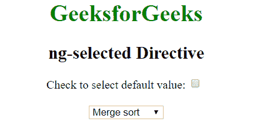
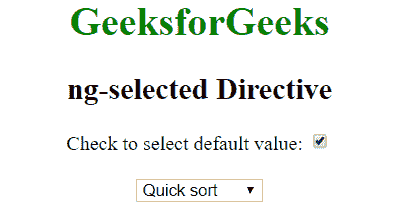

# 角度选择指令

> 原文:[https://www . geeksforgeeks . org/angularjs-ng-selected-direction/](https://www.geeksforgeeks.org/angularjs-ng-selected-directive/)

AngularJS 中的 **ng-selected 指令**用于指定 HTML 元素的选定属性。它可以用来选择在 HTML 元素上指定的默认值。如果 ng-selected 指令中的表达式返回 true，则显示选定的选项值，否则不显示。

**语法:**

```ts
<element ng-selected="expression"> Contents... </element> 
```

**示例:**本示例使用 ng-selected direction 显示所选元素。

```ts
<!DOCTYPE html>
<html>

<head>
    <title>ng-selected Directive</title>

    <script src=
"https://ajax.googleapis.com/ajax/libs/angularjs/1.4.2/angular.min.js">
    </script>
</head>

<body ng-app style="text-align:center">

    <h1 style="color:green">GeeksforGeeks</h1>
    <h2>ng-selected Directive</h2>     

    Check to select default value: 
    <input type="checkbox" ng-model="sort">

    <br><br>

    <select name="geek" >
        <option value="1" >Merge sort</option>
        <option value="2" ng-selected="sort">Quick sort</option>
        <option value="3">Bubble sort</option>
        <option value="4">Insertion sort</option>
    </select>
</body>

</html>                    
```

**输出:**
**之前勾选了复选框:**

**之后勾选了复选框:**
