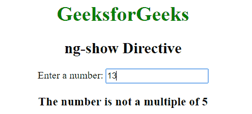

# AngularJS | ng-show 指令

> 原文:[https://www.geeksforgeeks.org/angularjs-ng-show-directive/](https://www.geeksforgeeks.org/angularjs-ng-show-directive/)

AngluarJS 中的 **ng-show 指令**用于显示或隐藏指定的 HTML 元素。如果在 ng-show 属性中给定的表达式为真，那么 HTML 元素将会显示，否则它会隐藏 HTML 元素。所有 HTML 元素都支持它。

**语法:**

```ts
<element ng-show="expression"> Contents... </element> 
```

**示例 1:** 本示例使用 ng-show 指令在选中复选框后显示 HTML 元素。

```ts
<!DOCTYPE html>
<html>

<head>
    <title>ng-show Directive</title>

    <script src=
"https://ajax.googleapis.com/ajax/libs/angularjs/1.6.9/angular.min.js">
    </script>
</head>

<body>
    <div ng-app="app" ng-controller="geek">

        <h1 style="color:green">GeeksforGeeks</h1>
        <h2>ng-show Directive</h2>

        <input id="chshow" type="checkbox" ng-model="show" />

        <label for="chshow">
            Show Paragraph
        </label>

        <p ng-show="show" style="background: green; color: white; 
                font-size: 14px; width:35%; padding: 10px;">
            Show this paragraph using ng-show
        </p>
    </div>

    <script>
        var myapp = angular.module("app", []);
        myapp.controller("geek", function ($scope) {
            $scope.show = false;
        });
    </script>
</body>

</html>                    
```

**输出:**
**之前勾选了复选框:**

**之后勾选了复选框:**


**示例 2:** 本示例使用 ng-show 指令显示输入的数字是否为 5 的倍数。

```ts
<!DOCTYPE html>
<html>

<head>
    <title>ng-show Directive</title>

    <script src=
"https://ajax.googleapis.com/ajax/libs/angularjs/1.6.9/angular.min.js">
    </script>
</head>

<body ng-app="app" style="text-align:center">
    <div ng-controller="geek" ng-init="val=0">
        <h1 style="color:green">GeeksforGeeks</h1>
        <h2>ng-show Directive</h2>

        Enter a number:
        <input type="text" ng-model="val" ng-keyup="check(val)">

        <div ng-hide="show">
            <h3>
                The number is multiple of 5
            </h3>
        </div>

        <div ng-show="show">
            <h3>
                The number is not a multiple of 5
            </h3>
        </div>
    </div>

    <script>
        var app = angular.module("app", []);
        app.controller('geek', ['$scope', function ($scope) {
            $scope.check = function (val) {
                $scope.show = val % 5 == 0 ? false : true;
            };
        }]);
    </script>
</body>

</html>                    
```

**输出:**
