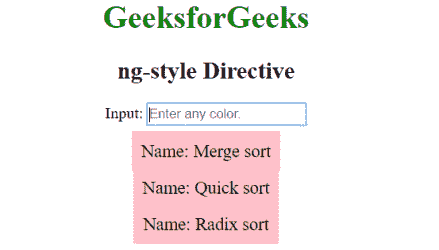
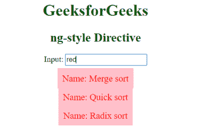

# AngularJS | ng 型指令

> 原文:[https://www.geeksforgeeks.org/angularjs-ng-style-directive/](https://www.geeksforgeeks.org/angularjs-ng-style-directive/)

AngularJS 中的 **ng 样式指令**用于在 HTML 元素上应用自定义的 CSS 样式。ng 样式指令中的表达式必须是一个对象。所有的 HTML 元素都支持它。
**语法:**

```ts
<element ng-style="expression"> Content ... </element> 

```

**示例:**

```ts
<!DOCTYPE html>
    <head>
        <title>ng-style Directive</title>
        <script src=
        "https://ajax.googleapis.com/ajax/libs/angularjs/1.4.2/angular.min.js">
        </script>
<style type="text/css">
    .bg-color {
        background-color: pink;
        padding:10px;
        font-size: 18px;
    }
</style>
    </head>
    <body ng-app="app" style="text-align:center">
      <h1 style="color:green">GeeksforGeeks</h1>
      <h2>ng-style Directive</h2>

    <div ng-controller="controllerName">
        Input: 
       <input type="text" ng-model="color" placeholder="Enter any color." />
        <p ng-repeat="i in sort" ng-style="{color:color}">
         <span class="bg-color">  Name: {{i.name}}</span>
        </p>
    </div>
    <script>
    var app = angular.module("app", []);
    app.controller('controllerName', ['$scope', function ($scope) {
        $scope.sort = [
       { name: 'Merge sort' }, 
       { name: 'Quick sort' }, 
       { name: 'Radix sort' }];
    }]);
</script>
</body>
</html>
```

**输出:**
**前:**

**后:**
