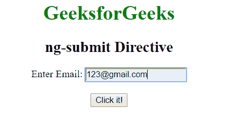
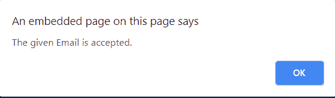
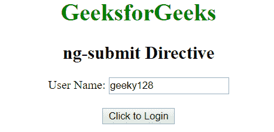
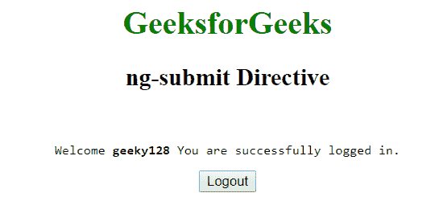

# AngularJS | ng-提交指令

> 原文:[https://www . geeksforgeeks . org/angularjs-ng-submit-direction/](https://www.geeksforgeeks.org/angularjs-ng-submit-directive/)

AngularJS 中的 **ng-submit 指令**用于指定在提交事件上运行的函数。如果表单不包含操作，它可用于阻止表单提交。由<形态>元素支撑。

**语法:**

```
<form ng-submit="expression"> Content ... </form> 

```

**例 1:**

```
<!DOCTYPE html>
<html>
    <head>
        <title>ng-submit Directive</title>
        <script src=
        "https://ajax.googleapis.com/ajax/libs/angularjs/1.4.2/angular.min.js">
        </script>

    </head>
    <body ng-app="app" style="text-align:center">
      <h1 style="color:green">GeeksforGeeks</h1>
      <h2>ng-submit Directive</h2>

    <div ng-controller="geek">
            <form name="form1" ng-submit="save(this)" novalidate>
               <label for="name">Enter Email: </label>
               <input type="email" name="email" data-ng-model="email" required />
               <br>
               <span>{{errorMsg}}</span>  
               <br>
               <input type="submit" value="Click it!">
            </form>
    </div>
    <script>
        var app = angular.module("app", []);
        app.controller('geek', ['$scope', function ($scope) {
            $scope.save = function ($this) {
                if ($this.form1.email.$error.required) {
                    $scope.errorMsg = "This field is required";
                }
                else if ($this.form1.$invalid) {
                    $scope.errorMsg = "Email is not valid";
                }
                else {
                    $scope.errorMsg = "";
                    alert("The given Email is accepted.");
                }
            }
        }]);
    </script>
</body>
</html>
```

**输出:**
**点击前:**

**点击后:**

**示例 2:**

```
<!DOCTYPE html>
    <head>
        <title>ng-submit Directive</title>
        <script src=
        "https://ajax.googleapis.com/ajax/libs/angularjs/1.4.2/angular.min.js">
        </script>

    </head>
    <body ng-app="app" style="text-align:center">
      <h1 style="color:green">GeeksforGeeks</h1>
      <h2>ng-submit Directive</h2>
    <div ng-controller="geek">
            <form name="form" ng-submit="login()" ng-hide="isShow">
            User Name: <input type="text" ng-model="users.user" required />
            <br /><br />            
            <button ng-disabled="form.$invalid">Click to Login</button>
            </form>
            <br>
            <pre ng-show="isShow">Welcome <b>{{name}}</b> 
             You are successfully login
             </pre>
            <input ng-show="isShow" type="button" value="Logout" 
            ng-click="isShow=false" />
    </div>
    <script>
        var app = angular.module("app", []);
        app.controller('geek', ['$scope', function ($scope) {
            $scope.users = {
                user: ""
            };
            $scope.login = function () {
                $scope.isShow = true;
                $scope.name = $scope.users.user;
                $scope.users = {
                    user: ""
                }
            };
        }]);
    </script>
</body>
</html>
```

**输出:**
**点击前:**

**点击后:**
