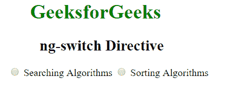
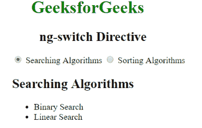
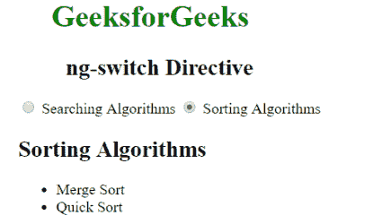
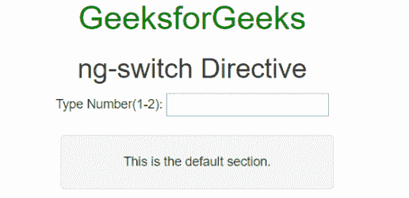
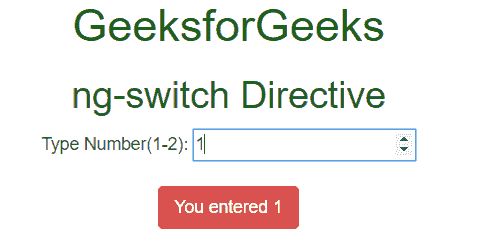

# 角度开关指令

> 原文:[https://www . geeksforgeeks . org/angular js-ng-switch-direction/](https://www.geeksforgeeks.org/angularjs-ng-switch-directive/)

AngularJS 中的 **ng-switch 指令**用于指定在 HTML DOM 中显示/隐藏子元素的条件。只有当 ng-switch 指令中的表达式返回 true 时，才会显示 HTML 元素，否则它将被隐藏。所有 HTML 元素都支持它。

**语法:**

```
<element ng-switch="expression">
  <element ng-switch-when="value"> Contents... </element>
  <element ng-switch-when="value"> Contents... </element>
  <element ng-switch-default> Contents... </element>
</element>

```

**示例 1:** 本示例使用 ng-switch 指令切换元素。

```
<!DOCTYPE html>
<html>

<head>
    <title>ng-switch Directive</title>

    <script src=
"https://ajax.googleapis.com/ajax/libs/angularjs/1.4.2/angular.min.js">
    </script>
</head>

<body ng-app="" style="">
    <h1 style="color:green;">GeeksforGeeks</h1>
    <h2>ng-switch Directive</h2>

    <div>
        <form>
            <label>
                <input type="radio" value="search" ng-model="switch.Data"> 
                Searching Algorithms
            </label>
            <label>
                <input type="radio" value="sort" ng-model="switch.Data"> 
                Sorting Algorithms
            </label>             
        </form>

        <div ng-switch="switch.Data" id="wrapper">
            <div ng-switch-when="search">
                <h2> Searching Algorithms</h2>
                <ul>
                    <li>Binary Search
                    <li>Linear Search
                </ul>
            </div>
            <div ng-switch-when="sort">
                <h2>Sorting Algorithms</h2>
                <ul>
                    <li>Merge Sort
                    <li>Quick Sort
                </ul>
            </div>
        </div>
    </div>
</body>

</html>                    
```

**输出:**

*   **之前点击单选按钮:**
    
*   **点击搜索单选按钮后:**
    
*   **点击排序单选按钮后:**
    

**示例 2:** 本示例使用 ng-switch 指令显示输入的号码。

```
<!DOCTYPE html>
<html>

<head>
    <title>ng-switch Directive</title>

    <script src=
"https://ajax.googleapis.com/ajax/libs/angularjs/1.4.2/angular.min.js">
    </script>

    <link rel="stylesheet" href=
"https://maxcdn.bootstrapcdn.com/bootstrap/3.2.0/css/bootstrap.min.css">
</head>

<body ng-app="" style="text-align:center;">

    <h1 style="color:green;">GeeksforGeeks</h1>
    <h2 style="">ng-switch Directive</h2>

    <div>
        <div class="col-md-3">
            Type Number(1-2): 
            <input ng-model="number" type="number" />
        </div><br>

        <div ng-switch="number" class="col-md-3">
            <div ng-switch-when="1" class="btn btn-danger">
                You entered {{number}}
            </div>

            <div ng-switch-when="2" class="btn btn-primary">
                You entered {{number}}
            </div>

            <div ng-switch-default class="well">
                This is the default section.
            </div>
        </div>
    </div>
</body>

</html>                    
```

**输出:**

*   **输入文本前:**
    
*   **输入文本后:**
    