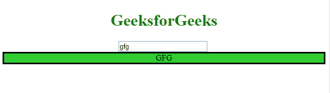
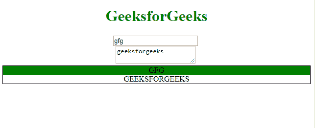
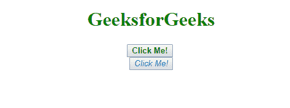

# AngularJS | ng-transclude 指令

> 原文:[https://www . geeksforgeeks . org/angular js-ng-transclude-direction/](https://www.geeksforgeeks.org/angularjs-ng-transclude-directive/)

**ng-transclude 指令**用于标记使用 transclusion 的最近父代的 transcluded DOM 的*插入点。使用转换槽名称作为**转换槽**或**转换槽**属性的值。*

**示例-1:**

```ts
<!DOCTYPE html>
<html>

<head>
    <meta charset="UTF-8">
    <script src=
"//ajax.googleapis.com/ajax/libs/angularjs/1.5.8/angular.min.js">
  </script>
</head>

<body ng-app="transcludeDemo">
    <center>
      <script>
        angular.module('transcludeDemo', [])
          .directive('pane', function() {
             return {
                restrict: 'E',
                 transclude: true,
                 scope: {
                    title: '@'
                 },
                 template: 
               '<div style="border: 3px solid black;">' +             
               '<div style="background-color: limegreen">'+
               '{{title.toUpperCase();}}</div>' +  
                          '<ng-transclude></ng-transclude>' +
                            '</div>'
                    };
                })
                .controller(
          'ExampleController', ['$scope', function($scope) {
                    $scope.title = 'gfg';
           }]);
      </script>
        <h1 style="color:green">GeeksforGeeks</h1>
        <div ng-controller="ExampleController">
            <input ng-model="title" aria-label="title">
            <br/>
            <pane title="{{title}}">
              <span>{{text}}</span></pane>
        </div>
    </center>
</body>

</html>
```

**输出:**

**例-2:**

```ts
<!DOCTYPE html>
<html>

<head>
    <meta charset="UTF-8">
    <title>
      simpleTranscludeExample
  </title>

    <script src=
"//code.angularjs.org/snapshot/angular.min.js">
  </script>
</head>

<body ng-app="transcludeDemo">
   <center>
      <script>
        angular.module('transcludeDemo', [])
          .directive('pane', function() {
            return {
              restrict: 'E',
              transclude: true,
              scope: {
                title: '@'
              },
              template:
       '<div style="border: 1px solid black;">' +
        '<div style="background-color: green">'+
              '{{title.toUpperCase();}}</div>' +
             '<ng-transclude></ng-transclude>' +
        '</div>'
            };
        })
                .controller(
          'ExampleController', ['$scope', function($scope) {
                    $scope.title = 'gfg';
                    $scope.text = 'geeksforgeeks';
                }]);
        </script>
        <h1 style="color:green">GeeksforGeeks</h1>
        <div ng-controller="ExampleController">
            <input ng-model="title" aria-label="title">
            <br/>
            <textarea ng-model="text" aria-label="text"></textarea>
            <br/>
            <pane title="{{title}}">
              <span>{{text.toUpperCase();}}</span></pane>
        </div>
    </center>
</body>

</html>
```

**输出:**


**示例-3:**

```ts
<!DOCTYPE html>
<html lang="en">

<head>
    <meta charset="UTF-8">
    <title>ng-transclude</title>

    <script src=
"//code.angularjs.org/snapshot/angular.min.js">
  </script>

</head>

<body ng-app="FallbackContentDemo">
  <center>
    <script>
      angular.module('FallbackContentDemo', [])
         .directive('myButton', function() {
             return {
               restrict: 'E',
               transclude: true,
                scope: true,
                template: 
               '<button style="cursor: wait;">' +
                              '<ng-transclude>' +
       '<b style="color: green;">Click Me!</b>' +
                            '</ng-transclude>' +
                            '</button>'
                    };
                });
        </script>
        <h1 style="color:green">GeeksforGeeks</h1>
        <!-- fallback button content -->
        <my-button id="fallback"></my-button>
        <!-- modified button content -->
        <br>
        <my-button id="modified">
            <i style="color: blue;">Click Me!</i>
        </my-button>
    </center>
</body>

</html>
```

**输出:**
