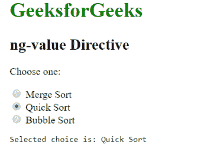

# AngularJS | ng 值指令

> 原文:[https://www.geeksforgeeks.org/angularjs-ng-value-directive/](https://www.geeksforgeeks.org/angularjs-ng-value-directive/)

AngularJS 中的 **ng 值指令**用于指定输入元素的值。支持<输入>、<选择>元素。

**语法:**

```ts
<element ng-value="expression"> Content ... </element> 

```

**例 1:**

```ts
<!DOCTYPE html>
<html>
    <head>
        <title>ng-value Directive</title>
        <script src=
        "https://ajax.googleapis.com/ajax/libs/angularjs/1.4.2/angular.min.js">
        </script>    
        </head>
    <body ng-app="app" style="padding:20px">
      <h1 style="color:green;">GeeksforGeeks</h1>
      <h2 style="">ng-value Directive</h2>
      <p>Choose one:</p>
      <div ng-controller="geek">
          <div ng-repeat="l in sort">
           <input type="radio" ng-model="my.fav" ng-value="l" name="Sort"> {{l}}
          </div>
          <pre>Selected choice is: {{my.fav}}</pre>
      </div>
      <script>
      var app = angular.module("app", []);
      app.controller('geek', ['$scope', function ($scope) {
          $scope.sort = ['Merge Sort', 'Quick Sort', 'Bubble Sort'];
          $scope.my = { fav: 'Merge Sort' };
      }]);
        </script>
    </body>
</html>
```

**输出:**
