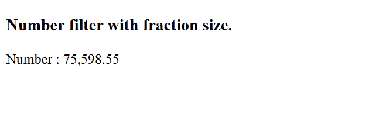
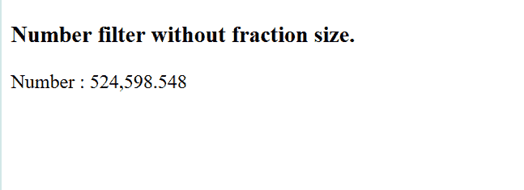

# AngularJS |数字过滤器

> 原文:[https://www.geeksforgeeks.org/angularjs-number-filter/](https://www.geeksforgeeks.org/angularjs-number-filter/)

AngularJS 数字过滤器用于将数字转换为字符串或文本。我们还可以定义显示小数位数的限制。数字过滤器将数字舍入到指定的十进制数字。

**语法:**

```
{{ string| number : fractionSize}}

```

**参数值:**包含单参数值**小数**，类型为数字，用于指定小数位数。

**示例 1:** 本示例将数字格式化，并将其设置为小数点后两位的分数。

```
<!DOCTYPE html>
<html>
    <head>
        <title>Number Filter</title>

        <script src=
"https://ajax.googleapis.com/ajax/libs/angularjs/1.6.9/angular.min.js">
        </script>
    </head>

    <body>

        <div ng-app="gfgApp" ng-controller="numberCntrl">
            <h3>Number filter with fraction size.</h3>
            <p>Number : {{ value| number  : 2}}</p>
        </div>

        <script>
            var app = angular.module('gfgApp', []);
            app.controller('numberCntrl', function($scope) {
                $scope.value = 75598.548;
            });
        </script>

    </body>
</html>
```

**输出:**


**示例 2:** 本示例将数字格式化，并将其设置为小数点后三位的分数。

```
<!DOCTYPE html>
<html>
    <head>
        <title>Number Filter</title>

        <script src=
"https://ajax.googleapis.com/ajax/libs/angularjs/1.6.9/angular.min.js">
        </script>
    </head>

    <body>

        <div ng-app="gfgApp" ng-controller="numberCntrl">
            <h3>Number filter without fraction size.</h3>
            <p>Number : {{ value| number}}</p>
        </div>

        <script>
            var app = angular.module('gfgApp', []);
            app.controller('numberCntrl', function($scope) {
                $scope.value = 524598.54812;
            });
        </script>

    </body>
</html>
```

**输出:**
