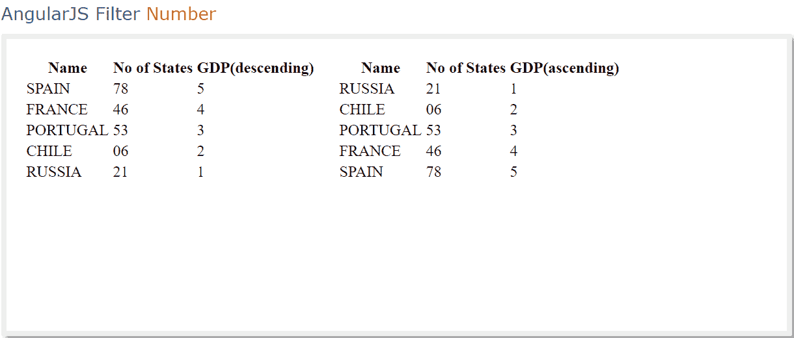

# 角度 JS | orderBy Filter

> 原文:[https://www.geeksforgeeks.org/angularjs-orderby-filter/](https://www.geeksforgeeks.org/angularjs-orderby-filter/)

**orderBy 过滤器**是一个用于角度 js 的便捷工具。
order by 频道鼓励您对展品进行分类。
当然，它按照顺序请求对字符串进行排序，并在数字请求中对数字进行排序。

**语法:**

```ts
{{ orderBy_expression | orderBy : expression : reverse }} 

```

**参数说明:**

**表达式:**用于决定请求。它很可能是一个字符串、作品或一个集群。
倒过来说:这是自由裁量的。如果您希望数据以相反的顺序显示，请确保参数中的相反条件设置为真。

例子:当我们检查名字时，按大小写排序

```ts
<!DOCTYPE html>  
<html>  
<script src=
"https://ajax.googleapis.com/ajax/libs/angularjs/1.4.8/angular.min.js">
</script>  
<body>  
<div ng-app="myApp" ng-controller="orderCtrl">  
<ul>  
<li ng-repeat="x in customers | orderBy : 'name'">  
    {{x.name + ", " + x.city}}  
</li>  
</ul>  
</div>  
<script>  
var app = angular.module('myApp', []);  
app.controller('orderCtrl', function($scope) {  
    $scope.customers = [  
        {"name" : "Amber", "city" : "ajmer"},  
        {"name" : "lakshay ", "city" : "vizag"},  
        {"name" : "karan", "city" : "London"},  
        {"name" : "bhaskar", "city" : "peshawar"},  

    ];  
});  
</script>  
<p>The array items are arranged by "name".</p>  
</body>  
</html>  
```

**输出:**


**例:当我们通过“-”和“+”Order by**查看 gdp 时，按案例排序

```ts
<!DOCTYPE html>
<html>
<head>
  <title>AnngularJS Filters : orderBy </title>
   <script src=
"https://ajax.googleapis.com/ajax/libs/angularjs/1.6.9/angular.min.js">
</script>
  <style>
    .tabled{float:left; padding:10px;}
  </style>
 </head>
<body ng-app="orderByDemo">
 <script>
  angular.module('orderByDemo', [])
    .controller('orderByController', ['$scope', function($scope) {
      $scope.countries =
          [{name:'SPAIN', states:'78', gdp:5},
           {name:'FRANCE', states:'46', gdp:4},
           {name:'PORTUGAL', states:'53', gdp:3},
           {name:'CHILE', states:'06', gdp:2},
           {name:'RUSSIA', states:'21', gdp:1}];
    }]);
</script>
<div ng-controller="orderByController">

  <table class="tabled">
    <tr>
      <th>Name</th>
      <th>No of States</th>
      <th>GDP(descending)</th>
    </tr>
    <!-- orderBy Descending (-) -->
    <tr ng-repeat="country in countries | orderBy:'-gdp'"> 
      <td>{{country.name}}</td>
      <td>{{country.states}}</td>
      <td>{{country.gdp}}</td>
    </tr>
  </table>

   <table class="tabled">
    <tr>
      <th>Name</th>
      <th>No of States</th>
      <th>GDP(ascending)</th>
    </tr>
    <!-- orderBy Ascending (+) -->
    <tr ng-repeat="country in countries | orderBy:'gdp'">  
      <td>{{country.name}}</td>
      <td>{{country.states}}</td>
      <td>{{country.gdp}}</td>
    </tr>
  </table>
</div>
</body>
</html>

<strong> Examples: Order by case (seven wonders)
```

**输出:**



```ts
<!DOCTYPE html>
<html>
<script src=
"https://ajax.googleapis.com/ajax/libs/angularjs/1.6.9/angular.min.js">
</script>
<body>

<div ng-app="myApplication" ng-controller="orderCtrl">

<ul>
<li ng-repeat="x in sevenwonder | orderBy : '-country'">
{{x.name + ", " + x.country}}</li>
</ul>

</div>

<script>
var application = angular.module('myApplication', []);
application.controller('orderCtrl', function($scope) {
    $scope.sevenwonder = [
        {"name" : "Great Wall of China" ,"country" : "China"},
        {"name" : "Christ the Redeemer Statue", "country" : "Brazil"},
        {"name" : "Machu Picchu", "country" : "peru"},
        {"name" : "Chichen Itza ", "country" : "Mexico"},
        {"name" : "The Roman Colosseum", "country" : "Rome"},
        {"name" : "Taj Mahal", "country" : "India"},
        {"name" : "Petra", "country" : "Jordan"}
    ];
});
</script>
<p>The array items are sorted by "country".</p>

</body>
</html>
```

**输出:**

