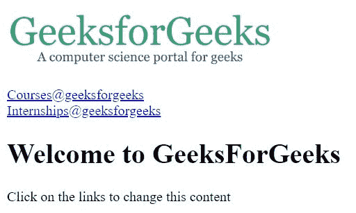
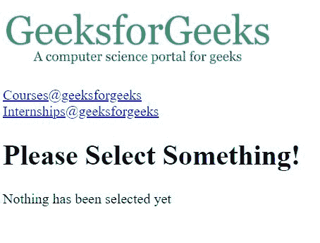

# 角度|路由

> 原文:[https://www.geeksforgeeks.org/angularjs-routing/](https://www.geeksforgeeks.org/angularjs-routing/)

当用户想要在一个应用程序中导航到不同的页面，但仍然希望它是一个单页应用程序时，就使用了 AngularJS 中的路由。AngularJS 路由使用户能够为应用程序中的不同内容创建不同的 URL。 **ngRoute** 模块帮助访问应用程序的不同页面，而无需重新加载整个应用程序。

**重要:**

*   $routeProvider 用于配置路由。它有助于定义用户单击链接时显示的页面。它接受 when()或其他()方法。
*   ngRoute 必须作为应用程序模块中的依赖项添加:

    ```ts
     //const app = angular.module("myApp", ["ngRoute"]);
    ```

**示例-1:仅使用“当”方法**

```ts
<!DOCTYPE html>
<html>
<script src=
"https://ajax.googleapis.com/ajax/libs/angularjs/1.6.9/angular.min.js">
</script>
<script src=
"https://ajax.googleapis.com/ajax/libs/angularjs/1.6.9/angular-route.js">
</script>

<body ng-app="myApp">

<p><a href="#/!">
</a></p>

<a href="#!courses">Courses@geeksforgeeks</a>
<br>
<a href="#!internships">Internships@geeksforgeeks</a>
<div ng-view></div>

<script>
const app = angular.module("myApp", ["ngRoute"]);
app.config(function($routeProvider) {
    $routeProvider
    .when("/", {
        template : `<h1>Welcome to GeeksForGeeks</h1>
                       <p>
                       Click on the links to change this content
                       </p>`
    })
    .when("/courses", {
        template : `<h1>Courses Offered</h1>
                       <p>
                         <ul>
                           <li>Machine Learning Foundation</li>
                           <li>Geeks Classes</li>
                           <li>System Design</li>
                         </ul>
                       </p>`
    })
    .when("/internships", {
        template : `<h1>Hire With Us</h1>
                       <p>
                         <ul>
                           <li>Software Developer</li>
                           <li>Technical Content Writer</li>
                           <li>Technical Content Engineer</li>
                         </ul>
                       </p>`
    });
});
</script>

</body>
</html>
```

**输出:**
**点击**
前

**点击课程@极客论坛**
后

**点击实习@GeeksForGeeks**
后

**示例-2:“否则”方法也与“当”**一起使用

```ts
<!DOCTYPE html>
<html>
<script src=
"https://ajax.googleapis.com/ajax/libs/angularjs/1.6.9/angular.min.js">
</script>
<script src=
"https://ajax.googleapis.com/ajax/libs/angularjs/1.6.9/angular-route.js">
</script>

<body ng-app="myApp">

<p><a href="#/!"></a></p>

<a href="#!courses">Courses@geeksforgeeks</a>
<br>
<a href="#!internships">Internships@geeksforgeeks</a>
<div ng-view></div>

<script>
const app = angular.module("myApp", ["ngRoute"]);
app.config(function($routeProvider) {
    $routeProvider
    .when("/courses", {
        template : `<h1>Courses Offered</h1>
                              <p>
                                <ul>
                                  <li>Machine Learning Foundation</li>
                                  <li>Geeks Classes</li>
                                  <li>System Design</li>
                                </ul>
                              </p>`
    })
    .when("/internships", {
        template : `<h1>Hire With Us</h1>
                              <p>
                                <ul>
                                  <li>Software Developer</li>
                                  <li>Technical Content Writer</li>
                                  <li>Technical Content Engineer</li>
                                </ul>
                              </p>`
    })
    .otherwise({
        template : `<h1>Please Select Something!</h1>
                              <p>
                              Nothing has been selected yet
                              </p>`
    });
});
</script>

</body>
</html>                    
```

**输出:**
**点击**
前

**点击课程@极客论坛**
后

**点击实习@GeeksForGeeks**
后