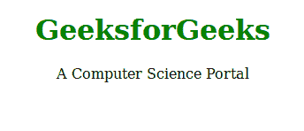
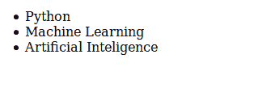
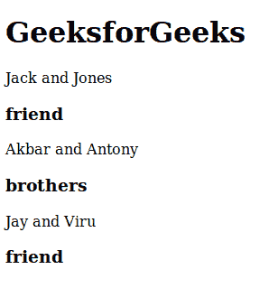

# 安圭拉\斯科普里

> 原文:[https://www.geeksforgeeks.org/angularjs-scope/](https://www.geeksforgeeks.org/angularjs-scope/)

AngularJS 中的作用域是 HTML 视图和 JavaScript 控制器的绑定部分。当您在 JavaScript 控制器中将属性添加到作用域对象中时，只有这样 HTML 视图才能访问这些属性。在语言中有两种类型的作用域。

*   **$范围**
*   **$rootScope**

**作用域:**作用域中几乎没有以下列出的特定功能

*   超文本标记语言视图
*   当前视图可用的数据称为模型
*   制作/改变/删除/控制数据的 JavaScript 函数称为控制器。

**语法:**

```
$scope

```

**示例 1:** 本示例将更清楚地说明范围概念本示例包含单个范围。

```
<!DOCTYPE html>
<html>

<head>
    <title>
      AngularJS | Scope
    </title>
    <script src=
"https://ajax.googleapis.com/ajax/libs/angularjs/1.6.9/angular.min.js">
    </script>
</head>

<body>

    <div ng-app="gfg" ng-controller="control" align="center">

        <h1 style="color:green;">{{organization}}</h1>
        <p>A Computer Science Portal</p>
    </div>

    <script>
        var geeks = angular.module('gfg', []);
        geeks.controller('control', function($scope) {
            $scope.organization = "GeeksforGeeks";
        });
    </script>

</body>

</html>
```

**输出:**


**示例 2:** 在上面的示例中只有一个作用域，在下面的示例中，您将看到多个作用域。

```
<!DOCTYPE html>
<html>

<head>
    <title>
        AngularJS | Scope
    </title>
    <script src=
"https://ajax.googleapis.com/ajax/libs/angularjs/1.6.9/angular.min.js">
    </script>
</head>

<body>

    <div ng-app="gfg" ng-controller="control">

        <ul>
            <li ng-repeat="x in names">{{x}}</li>
        </ul>

    </div>

    <script>
        var geeks = angular.module('gfg', []);

        geeks.controller('control', function($scope) {
            $scope.names = ["Python", "Machine Learning",
                               "Artificial Inteligence"];
        });
    </script>

</body>

</html>                    
```

**输出:**

**根作用域:**如果你的变量在根作用域和当前作用域中包含相同的名称，那么控制器或应用程序将使用当前作用域。
**语法:**

```
$rootScope
```

**示例 3:** 这个示例将向您展示如果变量名称在控制器的作用域和根作用域中相同会发生什么。

```
<!DOCTYPE html>
<html>

<head>
    <title>
        AngularJS | Scope
    </title>
    <script src=
"https://ajax.googleapis.com/ajax/libs/angularjs/1.6.9/angular.min.js">
    </script>
</head>

<body ng-app="gfg">
    <h1>GeeksforGeeks</h1>
    <p>Jack and Jones</p>
    <h3>{{relation}}</h3>

    <div ng-controller="control">

        <p>Akbar and Antony </p>
        <h3>{{relation}}</h3>

    </div>

    <p>Jay and Viru</p>
    <h3>{{relation}}</h3>

    <script>
        var geeks = angular.module('gfg', []);
        geeks.run(function($rootScope) {
            $rootScope.relation = 'friend';
        });
        geeks.controller('control', function($scope) {
            $scope.relation = "brothers";
        });
    </script>

</body>

</html>
```

**输出:**
