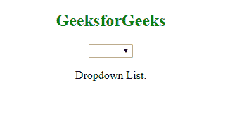
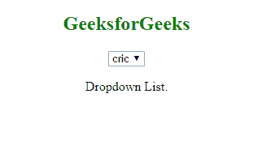

# 角度|选择框

> 原文:[https://www.geeksforgeeks.org/angularjs-select-boxes/](https://www.geeksforgeeks.org/angularjs-select-boxes/)

**ng-options:**
基于数组项目创建下拉列表时，应使用 ng-options 指令:
**示例-1:**

```
<!DOCTYPE html>
<html>
<script src=
 "https://ajax.googleapis.com/ajax/libs/angularjs/1.6.9/angular.min.js">
  </script>

<body>
    <center>
        <h2 style="color:green">GeeksforGeeks</h2>
        <div ng-app="gfg" ng-controller="myCtrl">

            <select ng-model="selectedName" 
                    ng-options="x for x in names">
            </select>

        </div>

        <script>
            var app = angular.module('gfg', []);
            app.controller('myCtrl', function($scope) {
                $scope.names = 
                  ["car", "cricket", "metro"];
            });
        </script>

        <p>Dropdown List.</p>
    </center>
</body>

</html>
```

**输出:**


**ng-repeat:**
使用 ng-repeat 指令制作相同的下拉列表。
ng-repeat 的 from 必须是一个字符串。
**例-2:**

```
<!DOCTYPE html>
<html>
<script src=
"https://ajax.googleapis.com/ajax/libs/angularjs/1.6.9/angular.min.js">
</script>

<body>
    <center>
        <h2 style="color:green">GeeksforGeeks</h2>
        <div ng-app="gfg" ng-controller="myCtrl">

            <select>
                <option ng-repeat="x in names">{{x}}
                </option>
            </select>

        </div>

        <script>
            var app = angular.module('gfg', []);
            app.controller('myCtrl', function($scope) {
                $scope.names = ["cric", "lion", "gfg"];
            });
        </script>

        <p>Dropdown List.</p>
    </center>
</body>

</html>
```

**输出:**
