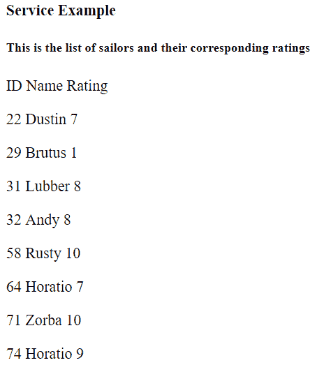

# AngularJS |服务

> 原文:[https://www.geeksforgeeks.org/angularjs-services/](https://www.geeksforgeeks.org/angularjs-services/)

[服务](https://docs.angularjs.org/guide/services)用于创建变量/数据，这些变量/数据可以共享，并且可以在定义它的组件之外使用。

*   **步骤#1:创建服务:-**

    ```ts
    ng g s service-name
    ```

    s 是服务的缩写。这将创建两个文件 service-name.service.spec.ts(不应该更改)和一个 service-name.service.ts。

*   **STEP #2:** After the service is created, we have to include it in the providers of **app.module.ts**

    在这里，服务名的第一个字母应该是大写的，后面跟着没有任何空格的服务。

*   **步骤#3:** 所以我们现在必须在**中进行更改，创建一个 json 变量，该变量应该对各种组件可用**

*   **STEP #4:** In **app.component.ts** make the following changes:

    ```ts
    import { Service-nameService } from './service-name.service';
    ```

    就像我们在供应商那里做的那样。

    **type: newData** 

    ```ts
    constructor(private demoService: ServiceService) {}
    ```

    ```ts
        ngOnInit(): void {
        this.newData=this.demoService.Sailors;

    ```

*   **STEP #5:** In **app.component.html** we will print the data stored in newData :

    ```ts
    {{newData}}
    ```

    **注意:由于我们已经在 app.component.html 添加了 NGF，我们将不得不在 app.module.ts** 中导入 FormsModule

    **语法(示例# 1):**
    **serie . service . ts**

    ```ts
    import { Injectable } from '@angular/core';

    @Injectable({
      providedIn: 'root'
    })
    export class ServiceService {

      Sailors = [
        {
          id: 22, name: 'Dustin', rating: 7
        },
        { 
          id: 29, name: 'Brutus', rating: 1
        },
        {
          id: 31, name: 'Lubber', rating: 8
        },
        {
          id: 32, name: 'Andy', rating: 8
        },
        {
          id: 58, name: 'Rusty', rating: 10
        },
        {
          id: 64, name: 'Horatio', rating: 7
        },
        {
          id: 71, name: 'Zorba', rating: 10
        },
        {
          id: 74, name: 'Horatio', rating: 9
        }
      ];

      constructor() { }
      getData() {
        return 'This is the list of sailors and their corresponding ratings';
      }
    }
    ```

    **app . component . ts**

    ```ts
    import { Component } from '@angular/core';
    import { ServiceService } from './service.service';
    @Component({
      selector: 'app-root',
      templateUrl: './app.component.html',
      styleUrls: ['./app.component.css']
    })
    export class AppComponent {
      newData;
      message:string='';
      constructor(private demoService: ServiceService) {}
      ngOnInit(): void {
        this.newData=this.demoService.Sailors;
        this.message=this.demoService.getData();
      }
    }
    ```

    **app.component.html**

    ```ts
    <b>Service Example</b>
    <h5>{{ message }}</h5>
    <p> ID Name Rating</p>
    <div *ngFor="let m of newData;">
        <p>{{m.id}} {{m.name}} {{m.rating}}</p>
    </div>
    ```

    **输出:**
    

    **参考文献:**
    [https://coursetro . com/post/code/61/Angular-4-服务-教程](https://coursetro.com/posts/code/61/Angular-4-Services-Tutorial)