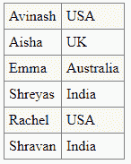

# 角度\ SQL

> 原文:[https://www.geeksforgeeks.org/angularjs-sql/](https://www.geeksforgeeks.org/angularjs-sql/)

在任何 web 应用程序中，我们都需要保存、更新、插入数据并从数据库中获取数据。AngularJS 是由谷歌开发的 JavaScript MVC 或模型-视图-控制器框架。它帮助开发人员构建结构良好、易于测试和维护的前端应用程序。

**特性**Angular JS 库中的重要概念如下:

*   概念
*   模板
*   指令
*   模型
*   范围
*   公式
*   编译程序
*   过滤器
*   数据绑定
*   控制器
*   组件
*   服务

**需要 AngularJS 框架用一个基本的例子来解释**有了对 HTML 元素和属性的指令，通过添加额外的编码就可以很容易地创建动态网页。AngularJS 非常有助于显示数据库中的数据。提供的数据应该是 JSON 格式。我们来看一个例子。数据在 MySQL 中，在服务器端 PHP 与 MySQL 交互，获取 JSON 格式的数据。角度 JS 显示输出。通过下面的基本示例，让我们详细了解 Angular JS SQL。

**示例:**

```ts
<html>
    <style>
        table,
        th,
        td {
            border: 1px solid grey;
            border-collapse: collapse;
            padding: 5px;
        }
        table tr:nth-child(odd) {
            background-color: #f1f1f1;
        }
        table tr:nth-child(even) {
            background-color: #ffffff;
        }
    </style>
    <script src=
"https://ajax.googleapis.com/ajax/libs/angularjs/1.6.9/angular.min.js">
  </script>
    <body>
        <div ng-app="empApp" 
             ng-controller="employeeCtrl">
            <table>
                <tr ng-repeat="output in names">
                    <td>{{ output.Name }}</td>
                    <td>{{ output.Country }}</td>
                </tr>
            </table>
        </div>

        <script>
            var app = angular.module("empApp", []);
            app.controller(
              "employeeCtrl", function ($scope, $http) {
                $http.get(
         "employee_mysql.php").then(function (response) {
                    $scope.names = response.data.records;
                });
            });
        </script>
    </body>
</html>
```

**说明:**ng-app 指令是一个起点。这里的“empApp”在 ng-app 中给出，这里初始化开始并编译 HTML 模板 ng-controller 用于在 HTML 元素中指定一个控制器。该控制器将添加行为或维护该 HTML 元素及其子元素中的数据**服务器代码 PHP 和 MySQL** 这里主要的是输出应该是 JSON 格式

**服务器代码 PHP 和 MySQL:**

```ts
<?php
header("Access-Control-Allow-Origin: *");
header("Content-Type: application/json; charset=UTF-8");

$connection = new mysqli("myServer", 
                         "<username>", 
                         "<password>", 
                         "<dbname>");

$result = $connection->query(
"SELECT EmployeeName, EmployeeCity,
EmployeeCountry FROM Employees");

$output = "";
while ($rs = $result->fetch_array(MYSQLI_ASSOC)) {
    if ($output != "") {
        $output = ", ";
    }
    $output .= '{"Name":"' . $rs["EmployeeName"] . '", ';
    $output .= '"City":"' . $rs["EmployeeCity"] . '", ';
    $output .= '"Country":"' .
      $rs["EmployeeCountry"] . '"}';
}
$output = '{"records":[' . $output . ']}';
$connection->close();

echo $output;
?>
```

假设雇员表有 6 条记录，它们在 MySQL 中。PHP 代码以 JSON 的格式从 MySQL 中检索数据，angular JS 显示输出。
**输出:**


**HTML 代码:**

```ts
<!DOCTYPE html>
<html>
    <style>
        table,
        th,
        td {
            border: 1px solid grey;
            border-collapse: collapse;
            padding: 5px;
        }
        table tr:nth-child(odd) {
            background-color: #f1f1f1;
        }
        table tr:nth-child(even) {
            background-color: #ffffff;
        }
    </style>
    <table>
        <tr>
            <td>Avinash</td>
            <td>USA</td>
        </tr>
        <tr>
            <td>Aisha</td>
            <td>UK</td>
        </tr>
        <tr>
            <td>Emma</td>
            <td>Australia</td>
        </tr>
        <tr>
            <td>Shreyas</td>
            <td>India</td>
        </tr>
        <tr>
            <td>Rachel</td>
            <td>USA</td>
        </tr>
        <tr>
            <td>Shravan</td>
            <td>India</td>
        </tr>
    </table>
</html>
```

**输出:**
