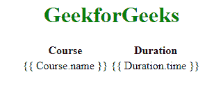
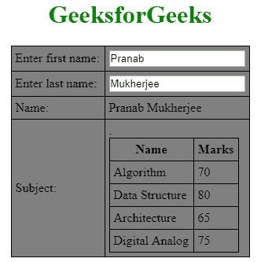

# 角\表

> 原文:[https://www.geeksforgeeks.org/angularjs-tables/](https://www.geeksforgeeks.org/angularjs-tables/)

表中的数据基本上是可重复的，因此您可以使用 **ng-repeat** 指令轻松创建表
该示例将明确这种方法。

**语法:**

```ts
<element ng-repeat="expression">Content..<element>

```

**表中显示的数据。**

```ts
<!DOCTYPE html>
<html>
<head>
    <title>AngularJS ng-repeat Directive</title>    
</head>
<body>
    <center>
        <h1 style="color:green;">GeekforGeeks</h1>
        <table> 
         <tr> 
          <th>Course</th> 
          <th>Duration</th> 
         </tr> 
         <tr ng-repeat = "subject in student.subjects"> 
          <td>{{ Course.name }}</td> 
          <td>{{ Duration.time }}</td> 
         </tr> 
        </table>
    </center>
</body>
</html>                    
```

**输出:**


**以 CSS 样式显示**

```ts
<style>
   table, th , td {
      border: 1px solid black;
      border-collapse: collapse;
      padding: 5px;
   }

   table tr:nth-child(odd) {
      background-color: #82E0AA  ;
   }

   table tr:nth-child(even) {
      background-color: #2ECC71  ;
   }
   h1{
       color:green;
   }
</style>
```

**带有上述代码的 AnhularJS ng-repeat 指令示例:**在这里，您将看到带有 AngularJS ng-repeat 指令的上述 html 和 css 的组合。

```ts
<!DOCTYPE html>
<html>
   <head>
      <title>Angular JS Table</title>
      <script src =
"https://ajax.googleapis.com/ajax/libs/angularjs/1.3.14/angular.min.js">
      </script>
      <style>
         table, th , td {
            border: 1px solid black;
            border-collapse: collapse;
            padding: 5px;
         }
         table {
            background-color: grey;
         }
         h1{
             color:green;
         }
      </style>
   </head>

   <body>
       <center>
      <h1>GeeksforGeeks</h1>
      <div ng-app = "mainApp" ng-controller = "studentController">

         <table border = "0">
            <tr>
               <td>Enter first name:</td>
               <td><input type = "text" ng-model = "student.firstName"></td>
            </tr>
            <tr>
               <td>Enter last name: </td>
               <td>
                  <input type = "text" ng-model = "student.lastName">
               </td>
            </tr>
            <tr>
               <td>Name: </td>
               <td>{{student.fullName()}}</td>
            </tr>
            <tr>
               <td>Subject:</td>

               <td>
                  <table>
                     <tr>
                        <th>Name</th>.
                        <th>Marks</th>
                     </tr>
                     <tr ng-repeat = "subject in student.subjects">
                        <td>{{ subject.name }}</td>
                        <td>{{ subject.marks }}</td>
                     </tr>
                  </table>
               </td>
            </tr>
         </table>
      </div>

      <script>
         var mainApp = angular.module("mainApp", []);

         mainApp.controller('studentController', function($scope) {
            $scope.student = {
               firstName: "Pranab",
               lastName: "Mukherjee",

               subjects:[
                  {name:'Algorithm',marks:70},
                  {name:'Data Structure',marks:80},
                  {name:'Architecture',marks:65},
                  {name:'Digital Analog',marks:75}

               ],

               fullName: function() {
                  var studentObject;
                  studentObject = $scope.student;
                  return studentObject.firstName + " " + studentObject.lastName;
               }
            };
         });
      </script>
   </center>   
   </body>
</html>
```

**输出:**
