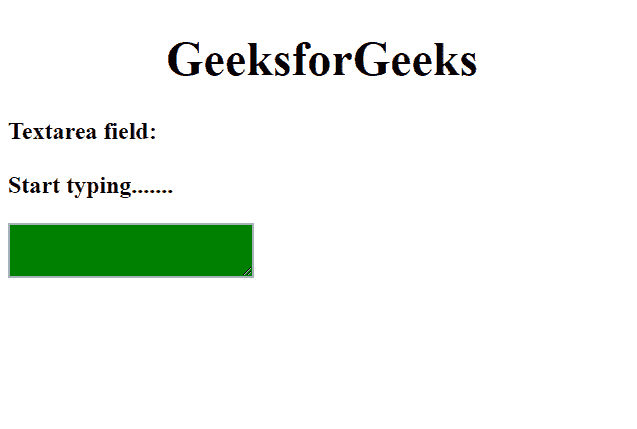

# angolajs | textarea 指令

> 原文:[https://www.geeksforgeeks.org/angularjs-textarea-directive/](https://www.geeksforgeeks.org/angularjs-textarea-directive/)

Textarea 元素提供验证和基本状态控制。属性 **ng-model** 参考**文本指令**。文本区域元素的当前状态由 Angular JS 保存。

**下面列出了文本区指令的状态:**

*   **$触摸:**表示触摸的区域。
*   **$未触及:**表示未触及的区域。
*   **$valid:** 表示有效的字段内容。
*   **$无效:**表示字段内容无效。
*   **$dirty:** 表示字段内容的修改。
*   **$ purify:**表示未修改的字段内容。

**语法:**

```
<textarea ng-model="name"></textarea>
```

**属性:**
类用于根据文本区域元素的状态来设置它们的样式。 **ng-model** 属性用于引用文本指令。

下面列出了常用的类别:

*   **ng-触摸:**表示在触摸的区域上应用的类别。
*   **ng-未接触:**表示应用于未接触区域的类。
*   **ng-valid:** 表示应用于有效字段内容的类。
*   **ng-无效:**表示用于无效字段内容的类。
*   **ng-purify:**表示用于在字段中有修改的状态的类。
*   **ng-dirty:** 表示与未修改的字段内容一起使用的类。

**返回值:**返回用户在文本字段中输入的文本。

**例 1:**

```
<!DOCTYPE html>
<html>
<script src=
"https://ajax.googleapis.com/ajax/libs/angularjs/1.6.9/angular.min.js">
  </script>
<style>
    textarea.ng-valid {
        color: green;
        background-color: lightgreen;
    }

    textarea.ng-invalid {
        background-color: green;
    }
</style>

<body ng-app="">

    <h1>
      <center>
        GeeksforGeeks
      </center>
  </h1>
    <p><b>Textarea field:<br><br>
Start typing.......</b></p>
    <textarea ng-model="gfg"
              required>
  </textarea>

</body>

</html>
```

**输出:**

**打字前:**


**输入后:**


**例 2:**

```
<!DOCTYPE html>
<html>
<script src=
"https://ajax.googleapis.com/ajax/libs/angularjs/1.6.9/angular.min.js">
</script>
<style>
    textarea.ng-dirty {
        color: green;
        background-color: lightgreen;
    }

    textarea.ng-pristine {
        background-color: green;
    }
</style>

<body ng-app="">

    <h1>
      <center>
        GeeksforGeeks
      </center>
  </h1>
    <p>
        <b>Textarea field:<br>
        <br>
Start typing.......</b></p>
    <textarea ng-model="gfg" required>
    </textarea>
</body>

</html>
```

**输出:**
**打字前:**


**输入后:**


**浏览器支持:**以下浏览器支持 texarea 指令。

*   谷歌 Chrome
*   微软公司出品的 web 浏览器
*   歌剧
*   火狐浏览器
*   狩猎