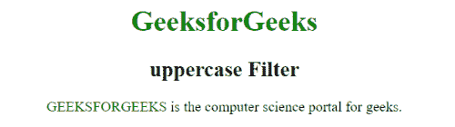

# AngularJs |大写过滤器

> 原文:[https://www.geeksforgeeks.org/angularjs-uppercase-filter/](https://www.geeksforgeeks.org/angularjs-uppercase-filter/)

AngularJS 中的**大写过滤器**用于*将字符串更改为大写字符串或字母*。

**语法:**

```ts
{{ string | uppercase}}
```

**示例:**

```ts
<!DOCTYPE html>
<html>

<head>
    <title>
      uppercase Filter
  </title>
    <script src=
"https://ajax.googleapis.com/ajax/libs/angularjs/1.5.6/angular.min.js">
    </script>
</head>

<body ng-app="app"
      style="text-align:Center">

    <h1 style="color:green">
      GeeksforGeeks
  </h1>
    <h2>
      uppercase Filter
  </h2>
    <div ng-controller="geek">
        <p>
            <span style="color:green">
              {{msg | uppercase}}
          </span> is the computer 
          science portal for geeks.
            <p>
    </div>
    <script>
        angular.module('app', [])
            .controller('geek', 
                        ['$scope', function($scope) {
                $scope.msg = 'GeeksforGeeks';
            }]);
    </script>
</body>

</html>
```

**输出:**
