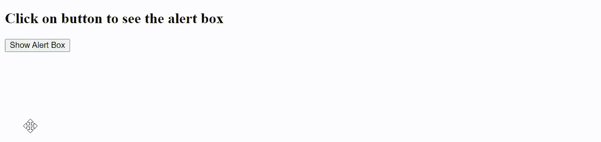
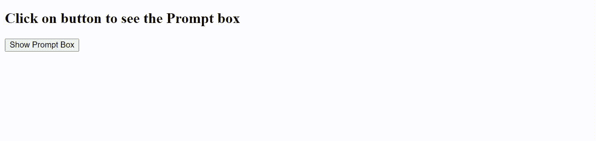
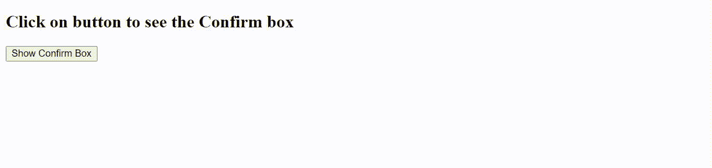

# AngularJS $窗口服务

> 原文:[https://www.geeksforgeeks.org/angularjs-window-service/](https://www.geeksforgeeks.org/angularjs-window-service/)

$window 服务引用了浏览器窗口对象。它在 JavaScript 中是全局可用的，因此会导致可测试性问题。在 AngularJS 中，它不是全局可用的。包括提醒框、提示框、确认框等多种方式。

现在让我们看看 Angular JS 中$window 服务的实际实现:

**1。$window.alert()方法:**此方法用于在窗口屏幕上显示报警信息。

## 超文本标记语言

```ts
<!DOCTYPE html>
<html>

<head>
    <title>$window service</title>
    <script src=
"https://ajax.googleapis.com/ajax/libs/angularjs/1.6.9/angular.min.js">
    </script>
</head>

<body ng-app="windowService">
    <h2>Click on button to see the alert box</h2>
    <div ng-controller="windowServiceController">
        <button ng-click="alertBox()">
            Show Alert Box
        </button>
    </div>

    <script>
        var app = angular.module('windowService', []);
        app.controller('windowServiceController',
            ['$scope', '$window',
                function ($scope, $window) {
                    $scope.message = "This is Alert Box";
                    $scope.alertBox = function () {
                        $window.alert($scope.message);
                    }
                }]);
    </script>
</body>

</html>
```

**输出:**



**2。$window.prompt()方法:**此方法用于在屏幕上显示提示信息。

## 超文本标记语言

```ts
<!DOCTYPE html>
<html>

<head>
    <title>$window service</title>
    <script src=
"https://ajax.googleapis.com/ajax/libs/angularjs/1.6.9/angular.min.js">
    </script>
</head>

<body ng-app="windowService">
    <h2>Click on button to see the Prompt box</h2>
    <div ng-controller="windowServiceController">
        <button ng-click="promptBox()">
            Show Prompt Box
        </button>

        <p>{{fullname}}</p>
    </div>

    <script>
        var app = angular.module('windowService', []);
        app.controller('windowServiceController',
            ['$scope', '$window',
                function ($scope, $window) {

                    $scope.promptBox = function () {
                        var name = $window.prompt('Enter Your Name');
                        $scope.fullname = 'Hello ' + name;
                    }
                }]);
    </script>
</body>

</html>
```

**输出:**



**3。$window.confirm()方法:**此方法用于在屏幕上显示确认框。

## 超文本标记语言

```ts
<!DOCTYPE html>
<html>

<head>
    <title>$window service</title>
    <script src=
"https://ajax.googleapis.com/ajax/libs/angularjs/1.6.9/angular.min.js">
    </script>
</head>

<body ng-app="windowService">
    <h2>Click on button to see the Confirm box</h2>
    <div ng-controller="windowServiceController">
        <button ng-click="confirmBox()">
            Show Confirm Box
        </button>

        <p>{{confirmMessage}}</p>
    </div>

    <script>
        var app = angular.module('windowService', []);
        app.controller('windowServiceController',
            ['$scope', '$window',
                function ($scope, $window) {

                    $scope.confirmBox = function () {
                        var choice = $window.confirm("Are you sure ?")
                        if (choice == true)
                            $scope.confirmMessage = 'Welcome';
                        else
                            $scope.confirmMessage = 'Sorry';
                    }
                }]);
    </script>
</body>

</html>
```

**输出:**

