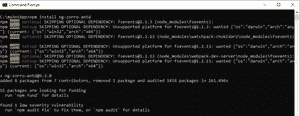
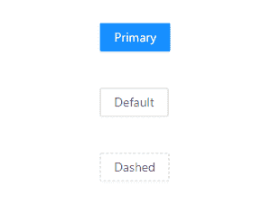

# 蚂蚁设计介绍及安装角铁

> 原文:[https://www . geesforgeks . org/ant-design-introduction-and-installation-for-angular/](https://www.geeksforgeeks.org/ant-design-introduction-and-installation-for-angular/)

**Ant Design** 是企业级产品的设计模式，可以与其他前端框架如 **Angular、React 或 Vue 集成。** Ant Design 官方实现与 React 一起发布，但也可以与其他 JavaScript 框架一起使用。它是一个开源工具，拥有大约 50.4 千颗 GitHub 星，是世界上第二大使用最多的 React UI 库。很多公司都在使用这种设计模式，比如**阿里巴巴、腾讯、滴滴等。**

**蚂蚁设计特点:**

*   支持国际化。
*   丰富的交互式用户界面。
*   强大的主题定制。
*   存在高质量的组件。
*   高性能。

**先决条件:**

*   像 VSCode，崇高，括号等代码编辑器。
*   节点应该安装在系统中

> **适用于车窗**
> 
> [https://www . geesforgeks . org/windows 上安装节点 js/](https://www.geeksforgeeks.org/installation-of-node-js-on-windows/)
> 
> **对于 Linux**
> 
> [https://www . geesforgeks . org/installation-of-node-js-on-Linux/](https://www.geeksforgeeks.org/installation-of-node-js-on-linux/)

*   Knowledge of setting up an Angular Project

    > [https://www.geeksforgeeks.org/angular-7-installation/](https://www.geeksforgeeks.org/angular-7-installation/)

    **安装蚂蚁设计的角度**

    *   在终端中，转到您创建的角度项目的文件夹，然后使用以下命令安装角度的蚂蚁设计:

    > npm 安装 ng-zorro-antd

    
    *   在**【angular . JSON】**文件中添加蚂蚁设计**。css** 文件中的样式数组如下所示:

        ```ts
        {
         "$schema": 
        "./node_modules/@angular/cli/lib/config/schema.json",
         "version": 1,
         "newProjectRoot": "projects",
         "projects": {
            "myAntApp": {
              "projectType": "application",
              "schematics": {
                "@schematics/angular:component": {
                  "style": "scss"
                }
              },
              "root": "",
              "sourceRoot": "src",
              "prefix": "app",
              "architect": {
                "build": {
                  "builder": 
        "@angular-devkit/build-angular:browser",
                  "options": {
                    "outputPath": "dist/myAntApp",
                    "index": "src/index.html",
                    "main": "src/main.ts",
                    "polyfills": "src/polyfills.ts",
                    "tsConfig": "tsconfig.app.json",
                    "aot": true,
                    "assets": [
                      "src/favicon.ico",
                      "src/assets"
                    ],
                    "styles": [
        "node_modules/ng-zorro-antd/src/ng-zorro-antd.min.css",
                      "src/styles.scss"
                    ],
                    "scripts": []
                  },
                  "configurations": {
                    "production": {
                      "fileReplacements": [
                        {
                          "replace": 
        "src/environments/environment.ts",
                          "with": 
        "src/environments/environment.prod.ts"
                        }
                      ],
                      "optimization": true,
                      "outputHashing": "all",
                      "sourceMap": false,
                      "extractCss": true,
                      "namedChunks": false,
                      "extractLicenses": true,
                      "vendorChunk": false,
                      "buildOptimizer": true,
                      "budgets": [
                        {
                          "type": "initial",
                          "maximumWarning": "2mb",
                          "maximumError": "5mb"
                        },
                        {
                          "type": "anyComponentStyle",
                          "maximumWarning": "6kb",
                          "maximumError": "10kb"
                        }
                      ]
                    }
                  }
                },
                "serve": {
                  "builder": 
        "@angular-devkit/build-angular:dev-server",
                  "options": {
                    "browserTarget": "myAntApp:build"
                  },
                  "configurations": {
                    "production": {
                      "browserTarget": "myAntApp:build:production"
                    }
                  }
                },
                "extract-i18n": {
                  "builder": 
        "@angular-devkit/build-angular:extract-i18n",
                  "options": {
                    "browserTarget": "myAntApp:build"
                  }
                },
                "test": {
                  "builder": "@angular-devkit/build-angular:karma",
                  "options": {
                    "main": "src/test.ts",
                    "polyfills": "src/polyfills.ts",
                    "tsConfig": "tsconfig.spec.json",
                    "karmaConfig": "karma.conf.js",
                    "assets": [
                      "src/favicon.ico",
                      "src/assets"
                    ],
                    "styles": [
                      "src/styles.scss"
                    ],
                    "scripts": []
                  }
                },
                "lint": {
                  "builder": "@angular-devkit/build-angular:tslint",
                  "options": {
                    "tsConfig": [
                      "tsconfig.app.json",
                      "tsconfig.spec.json",
                      "e2e/tsconfig.json"
                    ],
                    "exclude": [
                      "**/node_modules/**"
                    ]
                  }
                },
                "e2e": {
                  "builder": 
        "@angular-devkit/build-angular:protractor",
                  "options": {
                    "protractorConfig": "e2e/protractor.conf.js",
                    "devServerTarget": "myAntApp:serve"
                  },
                  "configurations": {
                    "production": {
                      "devServerTarget": "myAntApp:serve:production"
                    }
                  }
                }
              }
            }},
          "defaultProject": "myAntApp"
        }
        ```

    *   在**“app . module . ts”**中导入蚂蚁设计按钮模块，这样我们就可以在中访问它了。html 文件如下所示:

        ```ts
        import { BrowserModule } from '@angular/platform-browser';
        import { NgModule } from '@angular/core';

        import { AppRoutingModule } from './app-routing.module';
        import { AppComponent } from './app.component';
        import { NzButtonModule } from 'ng-zorro-antd/button';

        @NgModule({
          declarations: [
            AppComponent
          ],
          imports: [
            BrowserModule,
            AppRoutingModule,
            NzButtonModule
          ],
          providers: [],
          bootstrap: [AppComponent]
        })
        export class AppModule { }
        ```

    *   在**【app . component . html】**文件中添加如下代码如下:

        ```ts
        <button nz-button nzType="primary">Primary</button>
        <button nz-button nzType="default">Default</button>
        <button nz-button nzType="dashed">Dashed</button>
        ```

    *   Add some CSS in **“app.component.scss”** to show the buttons at the center as given below:

        ```ts
        [nz-button] {
          margin-left: 50%;
          margin-top: 3%;
        }
        ```

        *   在终端中，使用以下命令在浏览器中运行应用程序:

            ```ts
            ng serve -o
            ```

        **输出:**

        

        浏览器中的最终输出