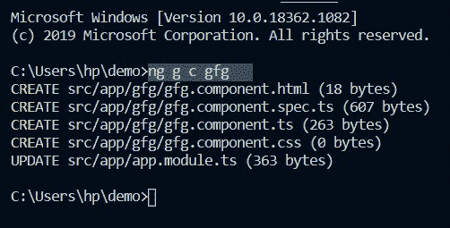
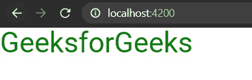

# 角度 8 中的组件

> 原文:[https://www.geeksforgeeks.org/components-in-angular-8/](https://www.geeksforgeeks.org/components-in-angular-8/)

该组件是 Angular 的基本构件。它有一个选择器、模板、样式和其他属性，并且它指定了处理组件所需的元数据。

**在角度 8 中创建组件:**

要在任何角度应用程序中创建组件，请执行以下步骤:

*   通过终端进入 angular app。
*   使用以下命令创建组件:

```
ng g c <component_name> 
OR
ng generate component <component_name> 
```

*   生成组件后，将创建以下文件:



**使用角度 8 中的组件:**

*   转到 component.html 文件并编写必要的 HTML 代码。
*   转到 component.css 文件并编写必要的 css 代码。
*   在 component.ts 文件中编写相应的代码。
*   使用 **ng 服务运行 Angular 应用程序–打开**

**实现代码:**请注意，下面代码中的组件名称为 **gfg 组件。**

**gfg.component.html:**

```
<h1>GeeksforGeeks</h1>
```

**gfg.component.css:**

```
h1{
    color: green;
    font-size: 30px;
}
```

**gfg.component.ts:**

```
import { Component, OnInit } from '@angular/core';

@Component({
  selector: 'app-gfg',
  templateUrl: './gfg.component.html',
  styleUrls: ['./gfg.component.css']
})
export class GfgComponent{
    a ="GeeksforGeeks";
}
```

**app.module.ts:**

```
import { NgModule } from '@angular/core';
import { BrowserModule } from '@angular/platform-browser';

import { AppComponent } from './app.component';
import { GfgComponent } from './gfg/gfg.component';

@NgModule({
  imports:      [ BrowserModule ],
  declarations: [ AppComponent, GfgComponent ],
  bootstrap:    [ AppComponent ]
})
export class AppModule { }
```

**输出:**

