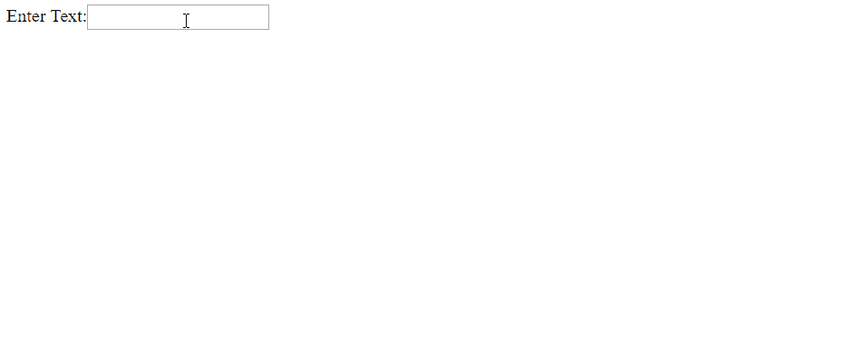
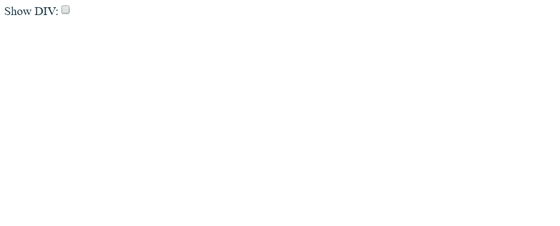
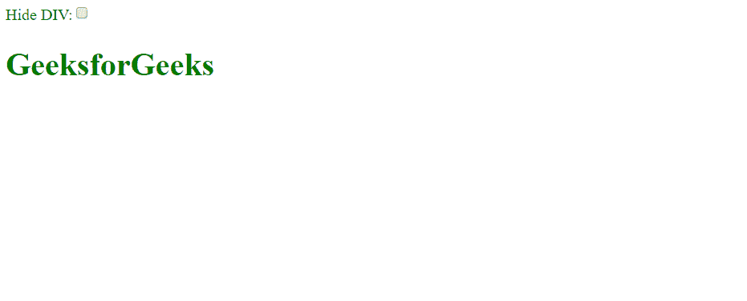

# 定义 ng-if、ng-show 和 ng-hide

> 原文:[https://www . geesforgeks . org/define-ng-if-ng-show-and-ng-hide/](https://www.geeksforgeeks.org/define-ng-if-ng-show-and-ng-hide/)

在本文中，我们将解释 ng-if、ng-show 和 ng-hide 指令。

*   **ng-if Directive:**

    AngularJS 中的 **ng-if 指令**用于根据表达式移除或重新创建 HTML 元素的一部分。

    如果里面的表达式是**假的**，那么元素就完全从 **DOM** 中移除了。

    如果表达式为**真**，那么元素将被添加到 **DOM** 中。

    **语法:**

    ```ts
    <element ng-if="expression"></element>

    ```

    **示例:**

    在以下示例中，当输入元素中有任何文本时，将显示 div 内容，否则它将被隐藏。

    ```ts
    <!DOCTYPE html>
    <html>
    <script src=
    "https://ajax.googleapis.com/ajax/libs/angularjs/1.6.9/angular.min.js">
    </script>
    <body ng-app="">

    Enter Text:<input type="text" ng-model="textcheck">

    <div ng-if="textcheck">
    <h1 style="color:green">GeeksforGeeks</h1>
    </div>

    </body>
    </html>
    ```

    **输出:**

    

    当输入字段中有任何文本时，标题 div 会添加到 HTML DOM 中并显示，但当输入字段为空时，div 会被移除并不显示。

*   **ng-show Directive:** The **ng-show Directive** in AngluarJS is used to show or hide the specified HTML element.

    如果在 **ng-show 属性中给定的表达式为真**，那么 **HTML 元素将显示**，否则将隐藏该 HTML 元素。

    **语法:**

    ```ts
    <element ng-show="expression"> </element> 
    ```

    **示例:**

    在下面的例子中，当他们的复选框被选中时，div 内容将被显示，否则它将被隐藏。

    ```ts
    <!DOCTYPE html>
      <html>
        <script src=
    "https://ajax.googleapis.com/ajax/libs/angularjs/1.6.9/angular.min.js">
        </script>
    <body ng-app="">

    <input type="checkbox" ng-model="check">

    <div ng-show="check">
      <h1 style="color:green">GeeksforGeeks</h1>
    </div>

    </body>
    </html>
    ```

    **输出:**

    

    选中复选框时，HTML 属性 div 被设置为显示，否则隐藏。

*   **ng-hide Directive:** The **ng-hide Directive** in AngluarJS is used to show or hide the specified HTML element.

    如果 **ng-hide 属性**中给出的表达式为真，则 HTML 元素隐藏。

    **ng-hide** 也是 AngularJS 中预定义的 CSS 类，将元素的显示设置为 **none** 。

    **语法:**

    ```ts
     <element ng-hide="expression"> </element> 

    ```

    **示例:**

    在这个例子中，如果复选框被选中，这意味着 ng-hide 属性为真，HTML 元素将被隐藏。

    ```ts
    <!DOCTYPE html>
      <html>
        <script src=
    "https://ajax.googleapis.com/ajax/libs/angularjs/1.6.9/angular.min.js">
        </script>
    <body ng-app="">

    Show DIV:<input type="checkbox" ng-model="check">

       <div ng-hide="check">
       <h1 style="color:green">GeeksforGeeks</h1>
    </div>

    </body>
    </html>
    ```

    **输出:**

    

    选中复选框时， **HTML 属性 div** 设置为**隐藏，否则显示**。

**ng-if、ng-show 和 ng-hide 的基本区别**

<center>

| ng-if 指令 | ng-show 指令 | ng-hide 指令 |
| --- | --- | --- |
| ng-if 指令基于表达式移除或重新创建 DOM 树的一部分，而不是隐藏它。 | ng-show 指令根据提供给 ng-show 属性的表达式显示或隐藏给定的 HTML 元素 | ng-hide 指令根据提供给 ng-hide 属性的表达式显示或隐藏给定的 HTML 元素。 |
| ng-if 只能在条件为真时呈现数据。在条件为真之前，它没有任何渲染数据。 | ng-show 可以显示和隐藏呈现的数据，也就是说，它始终保留呈现的数据，并根据该指令显示或隐藏。 | ng-hide 可以显示和隐藏呈现的数据，也就是说，它始终保留呈现的数据，并根据该指令显示或隐藏。 |

</center>

因此，ng-if、ng-show 和 ng-hide 指令之间有相当大的差异，这使得它们的用法不同。