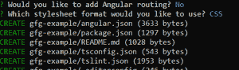

# 使用 Github 页面部署角度应用

> 原文:[https://www . geeksforgeeks . org/angular-application-use-github-pages/](https://www.geeksforgeeks.org/deployment-of-angular-application-using-github-pages/)

部署 Angular Application 的方法有多种，如 Github Pages、Heroku、Firebase 等。Github 提供了使用 Github 页面的最简单的方式。

**在 Github 页面上创建和部署示例角度应用程序的步骤:**

*   安装 node . js:
    a .[Windows](https://www.geeksforgeeks.org/installation-of-node-js-on-linux/)T3】b .[Linux](https://www.geeksforgeeks.org/installation-of-node-js-on-linux/)
*   [安装 Angular–CLI](https://www.geeksforgeeks.org/angular-7-installation/)
*   [使用 Angular CLI 创建新项目:](https://www.geeksforgeeks.org/angular-cli-angular-project-setup/)

```
ng new gfg-example
```

*   上述命令将询问路由和样式的各种问题，按回车键进入默认值:



*   创建项目后，使用以下命令转到项目目录:

```
cd gfg-example
```

*   守则的结构如下:


*   转到 src/app/app.component.html，删除所有代码并添加以下代码:

```
<h2 [ngStyle]="{'color':'#00FF00'}">
  Geeks For Geeks Example 
</h2>

<h3>
  Simple App Deployment using Github Pages
</h3>
```

*   现在使用以下方式在本地运行 Angular 应用程序:

```
npm start
```

*   App 编译成功后，转到浏览器打开 [http://localhost:4200/](http://localhost:4200/)


*   接下来，停止角度应用程序
*   转到 Github，并根据您的偏好使用该名称创建新的存储库
*   创建 Github Repo 后，转到项目目录并打开命令行
*   使用以下命令将代码推送到 Git:

```
git init
git add .
git commit -m "Initial Commit"
git remote add origin https://github.com/<username>/<reponame>.git
git push -u origin master

```

*   现在，转到 github repo，您的代码应该上传到 github 上的主分支
*   接下来，使用 npm 安装角形页面:

```
npm install -g angular-cli-ghpages

```

*   现在，生产使用以下方式构建应用程序:

```
ng build --prod --base-href "https://<username>.github.io/<reponame>/"

```

*   最后，创建 gh-pages 分支，并使用以下命令将构建和捆绑代码上传到该分支:

```
ngh --dir dist/gfg-example
```

*   请记住，我们从开始使用的项目名称是 gfg-例如，如果您有不同的项目名称，则使用以下命令代替最后一个命令:

```
ngh --dir dist/<project-name>
```


*   现在转到与 Github Repo 中的代码平行的“设置”选项卡，在 Github 页面下，您将找到已部署应用程序的链接:


*   打开网址，您将获得我们的角度应用部署:

