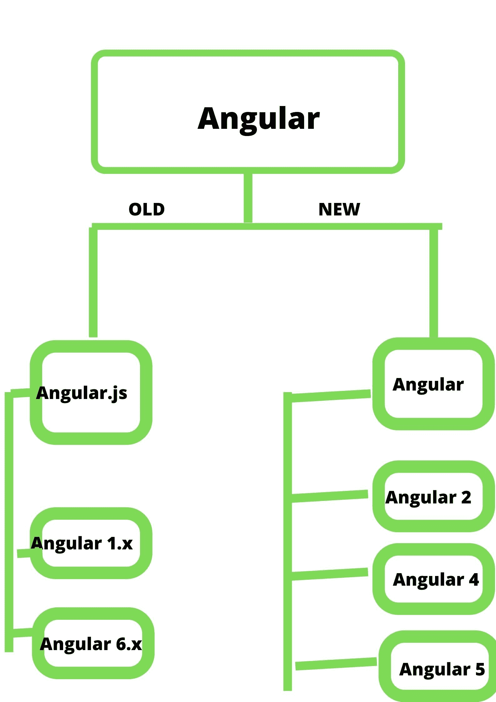
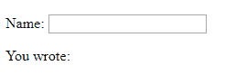
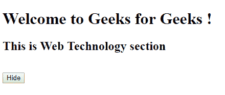
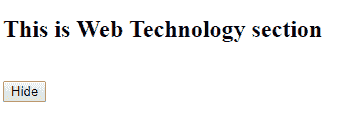

# 【Angular 和 jQuery 的区别

> 原文:[https://www . geeksforgeeks . org/angular-and-jquery 之差/](https://www.geeksforgeeks.org/difference-between-angular-and-jquery/)

jQuery 是一个开源的 JavaScript 库，它简化了 HTML/CSS 文档，或者更准确地说是文档对象模型(DOM)和 JavaScript 之间的交互。
jQuery 没有双向权威亮点，而 Angular 有转向、授权、双向信息权威、车型、信实灌输、单元测试等关键亮点。当风险的度量增加时，jQuery 变得复杂和难以维护，但是在 Angular 的情况下，事情是多样的，因为它们在巨大的范围内是合理的。很多时候，人们必须在 jquery 中键入更多代码才能实现同样的有用性，而 Angular 减少了这些标准，因为与 jQuery 相比，代码大部分都不长。

作为一个计算机化的时期，任何商业都要小心翼翼地展示亮点，以锁定他们的目标观众群体，这是非常重要的。电脑广告不过是我们在网上看到的网站。有几个阶段可以让你的梦想网站以用户为中心。这篇网络期刊《Angular vs JQuery》涵盖了网络改进领域中被广泛谈论的两个话题，一个是 Angular，另一个是 JQuery，这可能就是这篇 Angular vs JQuery 文章中的内容。

**Angular:**
angular 可以是一个基于 TYPESCRIPT 的开源前端 web 应用程序阶段，允许您形成响应迅速的单页应用程序(SPA)。Angular 结合了解释格式、reliance 注入、结论到结论工具，并协调了阐明进步挑战的最佳磨砺。



```
<!DOCTYPE html>
<html>
<script src=
"https://ajax.googleapis.com/ajax/libs/angularjs/1.6.9/angular.min.js">
  </script>

<body>

    <div ng-app="">

        <p>Name:
            <input type="text" ng-model="name">
        </p>
        <p>You wrote: {{ name }}</p>

    </div>

</body>

</html>
```

**输出:**


**jquery:**
jquery 可以是一个快速且功能丰富的 JavaScript 库，使用和学习都很简单。跨浏览器是一致的，最近的改编包括谷歌浏览器、火狐 Mozilla、网络先锋、苹果 Safari 和音乐剧。

```
<!DOCTYPE html> 
<html> 

<head> 
    <script src=
"https://ajax.googleapis.com/ajax/libs/jquery/3.3.1/jquery.min.js"> 
</script> 
</head> 

<body> 
    <h1>Welcome to Geeks for Geeks !</h1> 
    <h2>This is Web Technology section </h2> 
    <br/> 
    <button>Hide</button> 
    <script type="text/javascript"> 
        $("button").click(function() { 
            $("h1").hide(); 
        }); 
    </script> 
</body> 

</html> 
```

**输出:**
**前:**

**后:**


| jQuery | 有角的 |
| --- | --- |
| jquery 提供了一个稳定的 DOM API，它在所有支持的浏览器上都是稳定的 | Angular 给出了一个利用 JavaScript、CSS 和 HTML 制作网络应用程序的入门教程。 |
| 当涉及到用户界面组件(即 DOM)和代码(即 JavaScript)之间的权威组件时，就需要丰富的交互和功能。Jquery 是单向的，它建议基于模型的信息流 | 角度是双向的，这意味着用户界面区域必然会以这样一种方式有力地展示信息，即无论用户界面字段在哪个点发生变化，展示信息都会随之变化，反之亦然。 |
| Jquery 组件是 jquery UI，它可能是一组基于 jquery JavaScript 库节拍构建的精选的客户端界面直观、影响、小部件和主题 | 对于 Angular，组件是应用程序中用户界面的构件；这是一个组件的指挥链。这些组件有一个布局，可以说布局中的每个组件都可以实例化一个组件。 |
| **功能:**

*   lightweight
*   Ajax/JSONP
*   Cross-browser compatibility
*   html/domaint
*   CSS manipulation
*   event handling

 | **特性:**

*   MVC support
*   Form validation
*   Use serenity API
*   Accurate order is an extension of HTML.
*   Dependent injection
*   Bidirectional information binding

 |
| 易于记忆 | 理解很难得到它 |
|  |  |