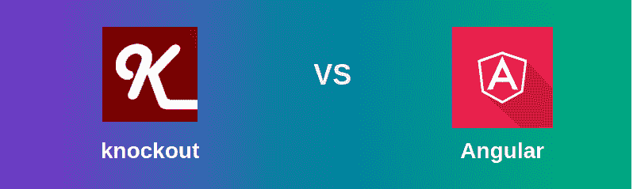
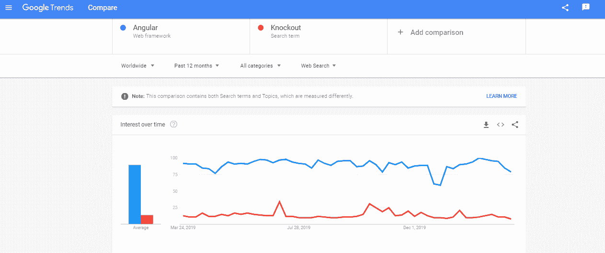

# 角度和敲除的区别

> 原文:[https://www . geeksforgeeks . org/angular-and-淘汰赛之差/](https://www.geeksforgeeks.org/difference-between-angular-and-knockout/)

**Angular** 是一个框架，**淘汰赛**是一个 JavaScript 库，提供帮助，使富有和响应的 web UI 变得智能。淘汰赛可能是一个库，它将用户界面的一部分与利用启示关系展示的信息进行接口。大致上也是如此，这就是混乱的来源。这两种安排之间的基本区别是，Angular 监督整个应用程序，并描述应用程序代码应该如何组织的规则，而使用淘汰赛，应用程序结构完全由您决定。

**Angular:** Angular 可能是一个能力非凡的 JavaScript 系统。它用于单页应用程序(SPA)风险。它用额外的属性放大了 HTML DOM，并使其对客户端活动更加敏感。Angular 是开源的，完全免费，全世界成千上万的设计师都在使用它。它是在 Apache 许可证改编 2.0 下授权的。Angular 是一个开源的 MVC JavaScript(编程方言)系统，它通过广告编程视图/模型同步来重新安排 web 改进。扩展到双向官方，精确是轻量级的，支持所有主要的浏览器，并为制作可测试的 JavaScript 代码而构建。

**angular . js 的特征:**

*   Restful 活动正迅速成为从服务器到客户端通信的标准。在一行 JavaScript 中，您将能够快速地与服务器对话，并获得您希望与网页关联的数据。AngularJS 把这变成了一个基本的 JavaScript 抗议，就像模型一样，模仿了 MVVM 的设计。
*   模型到视图模型对象的对话(通过一种叫做$scope 抗议的东西)，它调整模型的变化。此时，这些可以由 Sees 来传达和呈现，Sees 是传达您的代码的 HTML。Sees 可以利用$routeProvider 抗议来控制，所以你可以深度链接和组织你的 Sees 和 Controllers，把它们变成安全的 URL。此外，AngularJS 还提供了无状态控制器，可以初始化和控制$scope 抗议。
*   因此，MVVM 设计中的一切都是通过用户界面进行交流的，无论什么时候有什么变化。这消除了对包装器、获取器/设置器或过程语句的需求。AngularJS 处理所有这些，所以您将像使用 JavaScript 原语一样本质地表达您的信息，比如集群，或者像您希望的那样通过自定义排序来表达您的信息。因为一切都是随后发生的，所以您将在角度效益能力中查询您的条件作为参数，而不是一个巨大的基本()调用来执行您的代码。
*   现在建立的大多数网站都是一个巨大的标签排列，语义不太清晰。您希望形成广泛而详尽的 CSS 类来精确地考虑 DOM 中的每个问题。有了精确，你将能够像处理 XML 一样处理你的 HTML，给你无尽的标签和特性。精确实现了这一点，通过它的 HTML 编译器和利用命令来触发基于你新创建的句子结构的行为。

**淘汰赛:**淘汰赛是一个 JavaScript 库，它让你与干净的基本信息演示进行富有、响应迅速的展示和编辑用户界面。任何时候你有动态更新的用户界面片段(例如，根据用户的活动或外部信息源的变化而变化)，淘汰赛可以帮助你实现它更基本和可维护。淘汰赛建立在接受性扩展的基础上。需要在集群中包含的任何点执行工作。当财产价值改变时需要回应。当基本信息发生变化时，你的用户界面会如何自动地自我调整。你利用淘汰赛。与通常的信念相反，淘汰赛完全可以在没有用户界面的情况下使用。

**淘汰赛特点:**

*   因此，无论您的信息显示出什么变化，富依赖跟踪都会彻底检查您的用户界面的正确部分。
*   声明性绑定简单且不言而喻地将用户界面的各个部分传递给您的信息演示。您将有效地利用任意嵌套的绑定上下文来开发复杂的高能用户界面。
*   平凡的可扩展，实现自定义行为作为未使用的解释关系，以便在几行代码中简单重用。
*   纯 JavaScript 库可以与任何服务器端或客户端技术一起工作。
*   一套全面的决定(创建 BDD 风格)意味着它的纠正工作可以毫不费力地在现代浏览器和舞台上得到确认。

**基于谷歌趋势:**

<figure class="table">

| Sharp edges and corners | elimination game |
| --- | --- |
| The edges and corners are consistent with plain objects. This can be the watch factor and messy inspection strategy, so that there is no doubt that the expression of each evaluation is compared with the current protest value and the past problem value. | Knock out superior suppliers and use identifiable design. The reason is to track changes in this area and inform registered customers. |
| Angle feature is a testing system called protractor. | There is no testable code in the knockout. |
| Unusually broad documents constitute learning disabilities. It has no utility strategy. | The document is well organized, which gives me more opportunities to learn concepts. |
| Sharp edges and corners are frames. | The knockout is a Javascript library. |
| Sharp edges and corners are a full-fledged framework. | Knocking is just a data binding mechanism. |
| If you want to use ajax to interact with view in a better way [provide AJAX services]. | If you are concerned about View Interaction without AJAX [no AJAX service]. |

</figure>