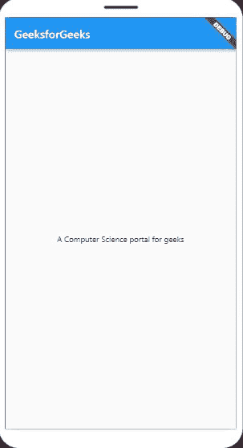

# 颤振和角度的差异

> 原文:[https://www . geeksforgeeks . org/颤振和角度的区别/](https://www.geeksforgeeks.org/difference-between-flutter-and-angular/)

**Flutter:** Flutter 是谷歌的 Mobile SDK，旨在从单一代码库中构建原生 iOS 和 Android、Desktop (Windows、Linux、macOS)、Web 应用。它是 2017 年 5 月创建的开源框架。当用 flutter 构建应用程序时，一切都指向 Widgets——构建 Flutter 应用程序的模块。它们是结构元素，附带了一堆特定于材料设计的功能，新的小部件也可以由现有的小部件组成。将小部件组合在一起的过程称为组合。应用程序的用户界面由许多简单的小部件组成，每个小部件处理一项特定的工作。

软件开发工具包包含许多工具，可以帮助您处理应用程序。其中一些工具使您能够在 iOS 和 Android 上将代码编译成本机机器代码。它由基于小部件的用户界面库组成。它由可重用的用户界面元素(按钮、文本字段、滑块等)组成。)可以根据您的需求进行重构或修改。

用于开发 Flutter 应用程序的编程语言是 Dart。Dart 是一种类型化的对象编程语言，由谷歌在 2011 年 10 月创建，但在过去几年中有了很大的改进。它用于开发移动和网络应用程序。Dart 的主要重点是前端开发。

**颤振的有利特征:**

*   Flutter 为安卓和 iOS 平台都使用了一个名为 Dart 的单一代码库，这是一种简单的语言，可以确保类型安全。
*   Flutter 不绑定到微件系统的只读存储器。因此，它增强了安卓版本的可移植性，从而降低了对主机平台的依赖。
*   Flutter 语言和社区都在飞速发展，发布了新的特性、小部件和附加组件。
*   飞镖和飞镖紧密结合，为飞镖特别需要的手机优化飞镖虚拟机。

让我们通过一个例子来理解这个概念。

**示例:**

## 镖

```
import 'package:flutter/material.dart';

void main() {
    runApp(GeeksForGeeks());
}

class GeeksForGeeks extends StatelessWidget {

    Widget build(BuildContext context) {

        // Material App
        return MaterialApp(

            // Scaffold Widget
            home: Scaffold(
                appBar: AppBar(

                    // AppBar takes a Text Widget
                    // in it's title parameter
                    title: Text('GeeksforGeeks'),
                ),
                body: Center(child: Text(
                'A Computer Science portal for geeks')),
            )
        );
    }
}
```

**输出:**



更多信息请参考官网[颤振教程](https://flutter.dev/docs) &颤振文档

**Angular:** Angular 是一个开源的前端框架，主要用于开发*单页 web 应用(SPAs)* 。这是一个用 TypeScript 编写的 JavaScript 框架。作为一个框架，它为开发人员提供了一个标准结构，使他们能够以易于维护的方式创建大型应用程序。它是一个不断增长和扩展的框架，为开发 web 应用程序提供了更好的方法。它把静态的 HTML 变成了动态的 HTML。

“Angular”这个名字只是指框架的不同版本。Angular 是在 2009 年开发的。

**Angular 的主要特征:**

**模型视图控制器(MVC):** 架构基本上是用来开发应用程序的软件模式。它通常由三个部分组成，它们是:

*   **模型:**用于管理应用数据。
*   **视图:**负责显示应用数据。
*   **控制器:**主要工作是连接模型和视图组件。

通常，当我们谈论 MVC 架构时，我们必须将我们的应用程序分成这三个组件，然后编写代码来连接它们。然而，在 AngularJs 中，我们所要做的就是将应用程序拆分成 MVC，其余的工作由它自己完成。它节省了大量时间，并允许您用更少的代码完成工作。

**数据模型绑定:**AngularJS 中的数据绑定是一个双向的过程，即 MVC 架构的视图层是模型层的精确副本。您不需要编写特殊的代码来将数据绑定到 HTML 控件。通常在其他 MVC 架构中，我们必须不断更新视图层和模型层，以保持彼此同步。在 AngularJs 中，可以说模型层和视图层保持彼此同步。就像当模型中的数据发生变化时，视图层会反映变化，反之亦然。它会立即自动发生，这有助于确保模型和视图随时更新。

**其他一些特性有:**

*   自定义组件
*   依赖注入
*   浏览器兼容性

我们将通过一个例子来理解这个概念。

**示例:**

## 超文本标记语言

```
<html>
  <head>
    <title>AngularJS ng-app Directive</title>

    <script src=
"https://ajax.googleapis.com/ajax/libs/angularjs/1.6.9/angular.min.js">
    </script>
  </head>

  <body style="text-align: center">
    <h2 style="color: green">ng-app directive</h2>

    <div ng-app="" ng-init="name='GeeksforGeeks'">
      <p>{{ name }} is the portal for geeks.</p>

    </div>
  </body>
</html>
```

**输出:**


**旋舞与棱角分明的区别:**

<figure class="table">T26】1。

| 

#### S 号

 | 

#### **Hyun dance**

 | 

#### T18 】 Sharp edges and corners

 |
| --- | --- | --- |
| Flutter 是一个谷歌用户界面工具包，用于从一个单一的代码库中为桌面、网络和移动制作漂亮的、本机编译的应用程序。 | Angular 是最适合你应用开发的框架。它是完全可扩展的，可以很好地与其他库一起工作。 |
| 2。 | 是用 Dart 语言写的。 | 它是用 Windows Typescript 语言 |
| 3\. Written and developed. | Flutter 只支持移动 OS。 | Angular 同时支持移动和电脑 OS。 |
| 4。 | 提供更快的应用。 | 报价相对较慢。 |
| 5。 | 稳定性相对较差。

 | 提供了更多的稳定性。 |
| 6。 | 它不支持 iOS 中任何应用的 32 位版本。 | 它支持 32 位版本。 |
| 7。 | Flutter 作为 SDK 工作。 | Angular 作为用户界面的构建模块工作。 |
| 8。 | 它使用了 Flutter Engine、Foundation 库、Dart 平台等组件。 | 它使用类型组件、数据绑定和依赖注入等组件。 |
| 9。 | 在 flutter 中，操作系统设计特定的小部件来构建应用程序。 | 在 angular 中，服务组件用于构建应用程序。 |
| 10。 | 使用 flutter 的公司有阿里巴巴、汉密尔顿音乐剧、艾比路工作室 app、Reflecting 等。 | 使用 angular 的公司有微软 Office、Upwork、通用汽车、YouTube、HBO 等。 |

</figure>