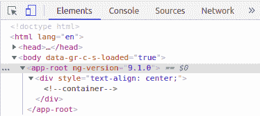
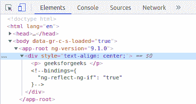
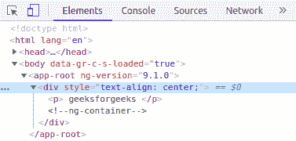
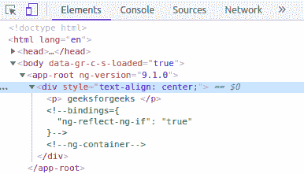

# AngularJS 中 ng 容器和 ng 模板的区别

> 原文:[https://www . geeksforgeeks . org/ng-container-and-ng-template-in-angular js/](https://www.geeksforgeeks.org/difference-between-ng-container-and-ng-template-in-angularjs/)

ng-container 和 ng-template 都可以用来创建响应性的动态组件。Angular 提供了一组可用于 ng 模板和 ng 容器的结构指令，例如:

*   ng-if
*   ng-for
*   ng 开关。

这些结构指令用于通过有条件地呈现 HTML 元素来改变 DOM 的结构。

ng-container 和 ng-template 都在隐藏自己的同时呈现包装好的元素，但是它们都遵循不同的机制，这些差异将在下面的文章中显示。

**ng-template:** 我们来试试一个例子:

```
import { Component } from '@angular/core';
@Component({
  selector: 'app-root',
  template: `
  <div style="text-align: center;">

  <!--no directive is used with ng-template-->

  <ng-template>
    <h1>
      {{title}}
    </h1>
  </ng-template>
  </div> 
  `,
  styleUrls: []
})
export class AppComponent {
  title = 'geeksforgeeks'; 
}
```

是的，不会渲染任何东西。当我们检查 HTML 代码时，我们会看到:



这是因为 ng-template 本身不会做任何事情。它需要一些渲染逻辑来渲染一些东西。

让我们试试另一个例子:

```
import { Component } from '@angular/core';

@Component({
  selector: 'app-root',
  template: `
  <div style="text-align: center;">

  <!--this time we will add an
 ng-if directive to ng-template.-->

  <ng-template [ngIf]="datahide">
  <p>
    {{ title }}
  </p>
  </ng-template>
  </div> 
  `,
  styleUrls: []
})
export class AppComponent {
  title = 'geeksforgeeks'; 
  datahide = true;
}
```

这次的输出会是这样的:



在这两个例子中，我们都可以看到模板注释本身，有条件地呈现包装的内容。

**ng-container:**“ng-container”确实与“ng-template”有一些相似之处，比如它们都呈现包装好的内容，同时省略了自己。但是，另一方面，当我们使用多个结构指令并且没有合适的父包装时，就要使用 ng-container。它不需要结构指令来呈现子元素，不像 ng-template 那样使用结构指令是必要的。

让我们看一个例子:

```
import { Component } from '@angular/core';

@Component({
  selector: 'app-root',
  template: `
  <div style="text-align: center;">

  <!--ng-container without any structural directive-->

  <ng-container>
  <p>
    {{ title }}
  </p>
  </ng-container>
  </div> 
  `,
  styleUrls: []
})
export class AppComponent {
  title = 'geeksforgeeks'; 
  datahide = true;
}
```

在这种情况下，即使没有任何结构指令，也呈现了 HTML:



让我们看看如果我们将一个 ng 模板包装在一个 ng 容器中会发生什么:

```
import { Component } from '@angular/core';

@Component({
  selector: 'app-root',
  template: `
  <div style="text-align: center;">

  <!--ng-container used as wrapper for ng-template-->

  <ng-container>
  <ng-template [ngIf]="datahide">
  <p>
    {{ title }}
  </p>
  </ng-template>
  </ng-container>
  </div> 
  `,
  styleUrls: []
})
export class AppComponent {
  title = 'geeksforgeeks'; 
  datahide = true;
}
```

ng 容器成功包装了 ng 模板:



最后，我们可以说 ng 容器和 ng 模板都是用来包装 HTML 元素的。它们的机制不同。此外，在 ng-template 内部不可能有多个结构指令，但是 ng-container 可以用来包装包含不同结构指令的多个元素，因此它是一个完美的容器。