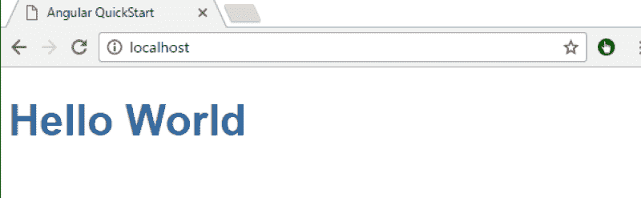

# AngularJS 中模板和模板 URL 的区别

> 原文:[https://www . geesforgeks . org/template-and-template URL-in-angular js/](https://www.geeksforgeeks.org/difference-between-template-and-templateurl-in-angularjs/)

我们知道， **@Component decorator** 是一个接受一个对象的函数，这个对象有很多属性。两大重要属性是模板&模板网址。

**在角度**中创建模板有多种方法

模板是用于用户界面的组件的一部分，最终用户可以通过它轻松地进行交互。我们可以通过以下两种方式创建模板:–

*   内嵌模板
*   外部模板

**内嵌模板:**

当我们在**中为组件定义模板时。ts** 文件它被称为内联模板内联模板是在组件装饰器中使用模板属性定义的。它指的是在类型脚本文件中写入所需的 HTML。让我们考虑一个例子。

打开 **app.component.ts** 文件，修改如下图所示的组件装饰器。这里需要借助倾斜字符来定义 HTML 内容。

## 超文本标记语言

```ts
<!--The content below is only a
    placeholder and can be replaced.-->
import { Component } from '@angular/core';

@Component({
    selector:'app-root',

    template:`<h3>Hello World</h3>`

})
export class AppComponent {
title = 'MyAngularApp'
```

另外，打开 **app.module.ts** 文件，将 AppComponent 设置为引导阵列中的启动组件，如下所示。

## 超文本标记语言

```ts
<!--The content below is only a
    placeholder and can be replaced.-->
@NgModule({
   declaration:[
     AppComponent,
     MyComponentComponent,
  ];

    imports: [
       BrowseModule,
       AppRoutingModule
   ],
    providers: [],,
    bootstrap : [AppComponent]
    })
export class AppModule { }
```

然后修改**index.html**页面，如下图。

## 超文本标记语言

```ts
<!--The content below is only a
    placeholder and can be replaced.-->
<!Doctype html>
    <html lang ="en">
    <head>
    <meta charset ="utf-8">
    <title>MyAngularApp</title>
    <base href="/">
    <meta name="viewport"
          content="width=device-width,
                   initial-scale=1">
    <link rel="icon"
          type="image/x-icon"
          href="favicon.ico">
    </head>
    <body>

    <app-root></app-root>

    </body>
    </html>
```

**现在，编译应用程序，您将获得以下输出。**

[](https://write.geeksforgeeks.org/?attachment_id=1903000)

**不能把 HTML 代码包含在单引号或者双引号里面吗？**

是的，我们可以在一对单引号或双引号中包含上面的 HTML 代码，或者直到 HTML 代码在一行中，如下所示。

这里我们使用**单引号。**

## 超文本标记语言

```ts
<!--The content below is only a
placeholder and can be replaced.-->
@Component({
    selector: 'app-root',

    template: '<h3>Hello World</h3>'

})
```

**当我们使用单引号时，输出将是:**


**使用双引号:**

您也可以用一对双引号替换上面的 HTML 代码，如下所示

## 超文本标记语言

```ts
<!--The content below is only a
    placeholder and can be replaced.-->
@Component({
    selector: 'app-root',

    template: "<h3>Welcome to GeeksforGeeks</h3>"
})
```

**当我们使用双引号时输出将是:**


**我们什么时候用 tilt 代替单引号或者双引号？**

当我们有多行 HTML 代码时，我们需要使用倾斜，否则你会得到一个**编译时错误。**
为了摆脱这个错误，我们需要使用**倒勾(倾斜)**如下图所示

## 超文本标记语言

```ts
<!--The content below is only a
    placeholder and can be replaced.-->
@Component({
    selector: 'app-root',

    template:`<h3>Let’s learn About the Angularjs. 
                  It is easy to understand.</h3>`

})
```

**当我们使用倒勾时，输出将是:**


**外部模板:**

在大多数实时情况下，我们需要使用 templateURL。当我们在一个外部文件中定义了模板，然后我们与我们的组件链接之后就被称为一个**外部模板。**

换句话说，外部模板在一个单独的文件中定义了 HTML 代码，我们可以使用组件装饰器的**模板 URL** 属性来引用该文件。TypeScript 文件包含使用“模板 URL”属性的 HTML 代码文件的路径。

**什么时候我们需要在 angular 中使用 templateURL？**

当我们使用复杂视图时，angular 建议在外部 HTML 文件而不是内联模板中创建该复杂视图。angular 组件装饰器提供了 templateUrl 的属性，使用这个属性我们可以设置外部 HTML 代码文件路径。

默认情况下，当我们创建任何新的 angular 项目时，Angular 会在应用程序文件夹内创建一个名为**app.component.html**的 HTML 代码文件。让我们考虑一个例子来理解如何使用 templateUrl 属性在组件装饰器中提供 HTML 代码路径。另外，一定要修改如下所示的 **app.component.ts** 文件，使用 templateUrl 属性设置一个外部 HTML 文件。

## 超文本标记语言

```ts
<!--The content below is only a
    placeholder and can be replaced.-->
    import { Component } from '@angular/core';

@Component({
    selector:'app-root',

    templateUrl:'app/app.Component.html'

})

    export class AppComponent {
    title = 'MyAngularApp';
}
```

**当我们使用 TemplateURL 将 app.component.ts 文件的代码引用到 app.component.ts 文件时，输出将是:**


**模板对角型圣殿骑士:**

在 AngularJS 中，我们可以在 HTML 标签中定义视图，并且有各种方法可以在 angular 组件中定义模板。

模板是角度组件最重要的部分之一，因为它允许我们为组件定义用户界面，我们可以有 2 种方法来定义模板。

*   **内嵌模板**
*   **外部模板**

就应用程序的性能而言，模板和 templateUrl 属性之间没有真正的区别。但是从开发人员的角度来看，有一些差异，我们将在这里讨论。

在 Angular 中，当我们有一个复杂的视图时，我们应该使用一个外部文件来使用 templateUrl ( **)，否则我们可以使用组件装饰器的模板(内嵌 HTML)属性。**

当我们使用内联模板时，我们不再拥有 Visual Studio 的智能支持、代码完成和格式化功能。但是有了外部模板，我们也将拥有 Visual Studio 的智能支持、代码完成和格式化功能。如果我们将 TypeScript 代码与内联 HTML 模板结合在一起，它并不总是值得研究和识别的。将 typescript 代码和相关联的 HTML 放在同一个记录中很方便，因为对等它们如何相互关联会变得简单得多。