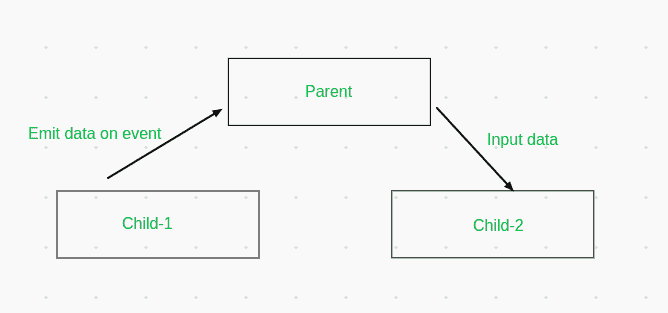

# 在 Angular 11

中建立兄弟组件之间的通信

> 原文:[https://www . geesforgeks . org/建立-兄弟组件之间的通信-in-angular-11/](https://www.geeksforgeeks.org/establish-communication-between-sibling-components-in-angular-11/)

在本文中，我们将看到如何在客户端机器上的兄弟组件之间传递数据。

在 Angular 中，我们将网页分成多个组件，这些组件之间的关系形成了一个树状结构。一个组件可能有一个父组件和多个子组件。也就是说，它也可以有兄弟姐妹。在某些情况下，我们需要在这些独立的组件之间传递数据。传递数据很容易，而且在处理大型项目时，它会使我们的代码更加清晰易读。

**先决条件:**必须预装 NPM。

要了解其工作原理，请参见下图:



*   在用户事件的情况下，我们可以从一个组件发出数据。
*   该数据将被发送到父组件。
*   父组件可以进一步将该数据以输入的形式传输给另一个子组件。
*   这是一种单向传输，但我们可以用另一种方式来建立双向通信通道。

在 Angular 中，我们可以利用其内置特性来实现这一点:

*   @Output 装饰器有助于通过事件发射器<t>对象发出数据。我们将通过这个例子看到它的工作原理。</t>
*   父组件将把数据捕获为$事件变量。它可以在一种方法中使用它，也可以通过其他方式传输它。
*   最后，@Input()装饰器使用一个变量，通过父级的任何输入都将存储在这个变量中。

让我们通过一个简单的例子来看看这一切。在这篇文章中，我们将看到一个简单的网页，它在一个组件中使用关键字作为用户输入，并在另一个组件中显示匹配的行。

让我们先设置环境:

*   安装 angular cli。以管理员身份运行或在出现权限错误时使用 sudo。

```html
npm i -g @angular/cli
```

*   安装 angular CLI 后，使用以下命令启动新项目:

```html
ng new <project-name>
```

*   现在使用以下方法进行测试:

```html
ng serve -o
```

*   如果可以在 http://localhost:4200 上访问角度着陆页面，则设置成功。在进一步行动之前，先弄清楚 app.component.html 的内容。
*   之后生成两个新组件:

```html
ng generate component search
ng generate component table
```

*   您将在应用程序文件夹中看到两个目录“search”和“table”。两者都将各有 4 个新文件。

让我们创建搜索组件并从中发出一个事件。首先在**search.component.html**写下以下代码:

## 超文本标记语言

```html
<br><br>
<div>
    <label for="search">Enter the text</label>
    <br>
    <br>
    <input type="text" id="search" placeholder="type some words" 
           (keyup)="emit(keyword.value);" #keyword>
</div>
```

在上面的代码中，有一个简单的输入字段，当 keyup 事件发生时，它使用 emit()函数。我们将使用它向父组件发出关键字。让我们在 **search.component.ts** 中定义这个方法和事件:

## java 描述语言

```html
import { Component, EventEmitter, OnInit, Output } 
        from '@angular/core';

@Component({
  selector: 'app-search',
  templateUrl: './search.component.html',
  styleUrls: ['./search.component.css']
})
export class SearchComponent implements OnInit {

  constructor() { }
  ngOnInit(): void {
  }
  @Output() emitter:EventEmitter<string>
       = new EventEmitter<string>();

  emit(keyword){
      this.emitter.emit(keyword);
  }
}
```