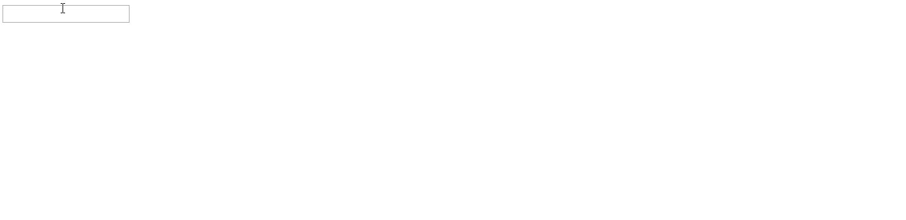

# 角度 8 中的事件绑定

> 原文:[https://www.geeksforgeeks.org/event-binding-in-angular-8/](https://www.geeksforgeeks.org/event-binding-in-angular-8/)

在 Angular 8 中，事件绑定用于处理按钮点击、鼠标移动、击键、等用户动作引发的事件。当 DOM 事件发生在一个元素上时(例如，单击、向下键、向上键)，它调用特定组件中的指定方法。

使用事件绑定，我们可以将数据从 DOM 绑定到组件，因此可以将这些数据用于进一步的目的。

**语法:**

```ts
< element (event) = function() >
```

**进场:**

*   在 app.component.ts 文件中定义一个函数来完成给定的任务。
*   在 app.component.html 文件中，将函数绑定到 HTML 元素上的给定事件。

**示例 1:** 使用上的点击事件输入元素。

**app.component.html**T3】

## 超文本标记语言

```ts
<h1>
  GeeksforGeeks
</h1>
<input (click)="gfg($event)" value="Geeks">
```

**app.component.ts**

## java 描述语言

```ts
import { Component } from '@angular/core';    
@Component({    
  selector: 'app-root',    
  templateUrl: './app.component.html',    
  styleUrls: ['./app.component.css']    
})    
export class AppComponent {    
  gfg(event) {
    console.log(event.toElement.value);
  }    
}
```

**输出:**


**示例 2:** 在上使用快捷键事件输入元素。

**app.component.html**T3】

## 超文本标记语言

```ts
<!-- event is passed to function -->
<input (keyup)="onKeyUp($event)">  

<p>{{text}}</p>
```

**app.component.ts**

## java 描述语言

```ts
import { Component } from '@angular/core';    
@Component({    
  selector: 'app-root',    
  templateUrl: './app.component.html',    
  styleUrls: ['./app.component.css']    
})    
export class AppComponent {   
  text = ''; 
  onKeyUp(x) { 

    // Appending the updated value
    // to the variable 
    this.text += x.target.value + ' | '; 
  } 
}
```

**输出:**

[](https://media.geeksforgeeks.org/wp-content/uploads/20200502124741/gfg-key.gif)