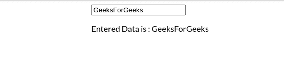

# Angular 6+

中的事件处理程序

> 原文:[https://www.geeksforgeeks.org/event-handler-in-angular-6/](https://www.geeksforgeeks.org/event-handler-in-angular-6/)

**简介:**

在 Angular 6 中，事件处理用于听到和捕捉所有事件，如点击、鼠标移动、击键等。这是 Angular 中存在的一个重要特性，无论大小，它都用于每个项目。

**语法:**

```
<HTML element (event) > =  function name()>
```

**语法解释:**

*   HTML 元素可以像<button>标签、输入标签等使用。</button>
*   在事件中，我们可以使用许多存在的事件，如(点击)、(改变)等。
*   我们需要在字符串中给出一个函数名，并且我们需要在 **ts** 文件中编写实现。

**Approach:**

*   根据上面的例子，用 HTML 文件中的任何关键事件声明一个事件处理程序。*   在 **ts** 文件中根据需求编写功能的实现。*   下面两个例子中，我们使用了不同的事件来使用这个概念。*   The one is (change) event and the second one is (click).

    **示例 1:** 使用变化:

    **app.component.html:**

    ```
    <input (change)="displayValue($event)">
    <p> Entered Data is : {{data}}</p>
    ```

    **app.component.ts:**

    ```
    import { Component } from '@angular/core';     
    @Component({     
      selector: 'app-root',     
      templateUrl: './app.component.html',     
      styleUrls: ['./app.component.css']     
    })     
    export class AppComponent {    
      data:String = '';  
      displayValue(event){
            this.data = event.target.value;  

      }  
    }
    ```

    **app.module.ts:**

    ```
    import { NgModule } from '@angular/core';
    import { BrowserModule } from '@angular/platform-browser';
    import { FormsModule } from '@angular/forms';

    import { AppComponent } from './app.component';

    @NgModule({
      imports:      [ BrowserModule, FormsModule ],
      declarations: [ AppComponent ],
      bootstrap:    [ AppComponent ],
      providers: []
    })
    export class AppModule { }
    ```

    **输出:**

    
    

    **示例 2:** 使用 onclick:

    **app.component.html:**

    ```
    <div>
      <button (click)="handleClick()">
        Tap Here to Display and Hide the Company name
      </button>
    </div>
    <br>
    <div *ngIf="toDisplay" class="data">
      <div class="centered">
        {{name}}
      </div>
    </div>
    ```

    **app.component.ts:**

    ```
    import { Component } from '@angular/core';

    @Component({
      selector: 'app-root',
      templateUrl: './app.component.html',
      styleUrls: ['app.component.scss']
    })
    export class AppComponent  {
      name: string = '';

      toDisplay =false;

      handleClick() {
        this.toDisplay = !this.toDisplay
        this.name = 'GeeksForGeeks'

      }

    }
    ```

    **app.module.ts:**

    ```
    import { NgModule } from '@angular/core';
    import { BrowserModule } from '@angular/platform-browser';
    import { FormsModule } from '@angular/forms';

    import { AppComponent } from './app.component';

    @NgModule({
      imports:      [ BrowserModule, FormsModule ],
      declarations: [ AppComponent ],
      bootstrap:    [ AppComponent ],
      providers: []
    })
    export class AppModule { }
    ```

    **输出:**

    **点击图标前:**

    

    **点击图标后:**

    