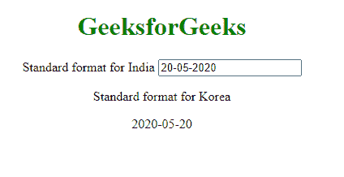
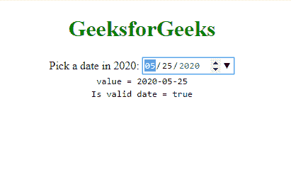

# 在 AngularJS

中使用 ng 模型格式化日期

> 原文:[https://www . geesforgeks . org/format-a-date-use-ng-model-in-angular js/](https://www.geeksforgeeks.org/format-a-date-using-ng-model-in-angularjs/)

ng-model 指令用于将输入字段的值绑定到控制器中的属性。格式化器用于将输入值从一种纹理表示转换为另一种所需的表示。当日期需要根据国家指定的格式在不同的位置进行更新时，用于日期格式化的格式化程序非常有用。

**语法:**如下例所示，必须在 HTML 标签中添加以下属性。

> input type = " date " id = " example input " name = " input " ng _ model = " example . value "

用法:

> 输入 type = " date "
> ng-model = " string "
> 【name = " string "】
> 【min = " string "】
> 【max = " string "】
> 【ng-min = "】
> 【ng-max = "】
> 【required = " string "】
> 【ng-required = " string "】
> 【ng-change = " string "】

上述参数用作 ng 模块中的输入组件。在下面的例子中，我们将看到这些参数是如何被使用的。

**示例 1:** 第一个示例显示了如何更改日期的格式。这是一个简单的 HTML 代码，其中您的国家格式日期的 ng-model 值被更改为其他国家格式的日期。

```html
<!DOCTYPE html>
<html lang="en">

<head>
    <meta charset="UTF-8">
    <title>
        Format a Date using 
        ng-model in AngularJS
    </title>

    <script src=
        "//code.angularjs.org/snapshot/angular.min.js">
    </script>
</head>

<div ng-app="gfg">
    <div ng-controller="dateCtrl" class="container">
        <script>
            angular.module('gfg', [])

                .controller('dateCtrl', function ($scope) {
                    $scope.firstDate = new Date();
                    $scope.secondDate = "2020-05-20";
                })
                .directive('date', function (dateFilter) {
                    return {
                        require: 'ngModel',
                        link: function (scope, 
                                       elm, attrs, ctrl) {

                            var dateFormat =
                                attrs['date'] || 'yyyy-MM-dd';

                            ctrl.$formatters.unshift(
                                    function (modelValue) {
                                return dateFilter(
                                    modelValue, dateFormat);
                            });
                        }
                    };
                })

        </script>
        <p>
            <center>
                <h1 style="color: green">
                    GeeksforGeeks
                </h1>

                <label for="">
                    Standard format for India 
                </label>

                <input type="text" date='dd-MM-yyyy' 
                        ng-model="secondDate" 
                        class="form-control" />

                <p class="text-primary">
                    <label for="">
                        Standard format for Korea
                    </label>
                </p>
                {{secondDate}}
            </center>
        </p>
    </div>
</div>

</html>
```

**输出:**


**示例 2:** 在下面的 HTML 代码片段中，展示了如何从日期选择器菜单中输入日期，然后以给定的格式表示，即 *yyyy-mm-dd* 。此外，还提供了验证检查，以检查用户给出的日期是否在程序要求的范围内。对于最小和最大日期值，我们使用了“min”和“max”参数，如下所示:此外，如果未输入值，“必需”参数将设置必需的验证错误密钥。

```html
<!DOCTYPE html>
<html lang="en">

<head>
    <meta charset="UTF-8">
    <title>
        Format a Date using 
        ng-model in AngularJS
    </title>

    <script src=
        "//code.angularjs.org/snapshot/angular.min.js">
    </script>
</head>
<center>

    <body ng-app="dateInputExample">
        <script>
            angular.module('dateInputExample', [])
                .controller(
                    'DateController', ['$scope',
                            function ($scope) {
                        $scope.example = {
                            value: new Date(2020, 4, 25)
                        };
                    }]);
        </script>
        <form name="myForm" ng-controller=
                "DateController as dateCtrl">

            <h1 style="color: green">
                GeeksforGeeks
            </h1>

            <label for="exampleInput">
                Pick a date in 2020:
            </label>

            <input type="date" id="exampleInput" 
                    name="input" ng-model="example.value"
                    placeholder="yyyy-MM-dd"
                    min="2020-01-01" max="2020-12-31"
                    required />

            <div role="alert">
                <span class="error" ng-show=
                    "myForm.input.$error.required">
                    Required!
                </span>

                <span class="error" ng-show=
                    "myForm.input.$error.date">
                    Not a valid date!
                </span>
            </div>

            <tt>
                value = {{example.value | 
                    date: "yyyy-MM-dd"}}
            </tt><br />

            <tt>
                Is valid date = 
                {{myForm.input.$valid}}
            </tt><br />
        </form>
    </body>

</html>
```

**输出:**


**参考:**T2】https://docs.angularjs.org/api/ng/input/input%5Bdate%5D