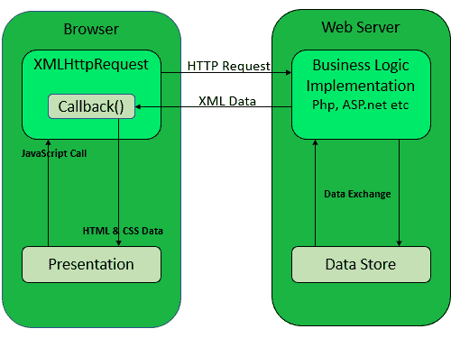

# 【ajax 是如何工作的？角度 js 和 jquery 的区别

> 原文:[https://www . geesforgeks . org/how-Ajax-works-angular-js-and-jquery 之差/](https://www.geeksforgeeks.org/how-ajax-works-difference-between-angular-js-and-jquery/)

**Ajax:** Ajax 通过使用 XMLHttpRequest 对象与服务器进行通信。用户从用户界面发送请求，JavaScript 调用转到 XMLHttpRequest 对象，然后 *XMLHttp 请求*被发送到 *XMLHttpRequest 对象*。当时服务器使用 php、servlet、ASP.net 等与数据库交互。检索数据，然后服务器将数据以 XML 或 Jason 数据的形式发送到 *XMLHttpRequest 回调函数*。然后 HTML 和 CSS 在浏览器上显示数据。

**注:**流程图显示在浏览器上显示数据的过程。

**AngularJS 特性:**AngularJS 有很多特性，列举如下:

*   动画支持
*   数据绑定
*   深度链接
*   依赖注入
*   表单验证
*   可重用组件(指令、自定义指令)
*   按指定路线发送
*   单元测试

**jQuery 特性:**jQuery 有很多特性，如下所列:

*   AJAX 调用
*   效果和动画
*   事件方法
*   DOM 操作

**AngularJS 和 jQuery 的区别:**AngularJS 和 jQuery 的区别太多了，下面列出来:

*   AngularJS 支持 MVC(现代视图控制器)模式在客户端创建 web 应用程序，而 JQuery 不允许将应用程序代码写入 MVC(现代视图控制器)模式。
*   AngularJS 自带 RESTFul API，而 JQuery 没有。
*   AngularJS 支持深度链接路由，但 jQuery 中不允许。
*   与 jQuery 相比，AngularJS 是完成相同任务所需的短代码。
*   AngularJS 支持“双向数据绑定”，但 JQuery 不允许“双向数据绑定”。
*   AngularJS 比 jQuery 重。