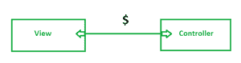
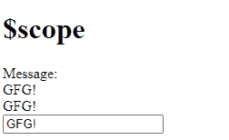
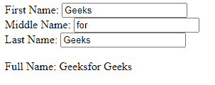
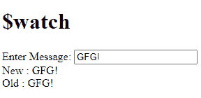
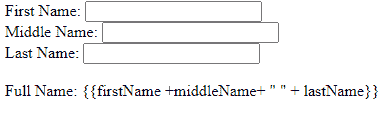

# 【AngularJS 前缀$和$是如何使用的？

> 原文:[https://www . geeksforgeeks . org/how-angularjs-前缀和被使用/](https://www.geeksforgeeks.org/how-angularjs-prefixes-and-are-used/)

*   **$:**

    AngularJs 中的$是一个内置对象。它包含应用程序数据和方法。

    作用域($)充当控制器和视图之间的链接。

    

    **范围($)**

    在控制器函数内部，可以附加作用域($)的属性和方法。*表达式*、 *ng-model* 或 *ng-bind* 指令可用于显示视图中的范围数据。

    ```ts
    <!DOCTYPE html>
    <html>
    <head>
        <script src=
    "https://ajax.googleapis.com/ajax/libs/angularjs/1.3.16/angular.min.js">
        </script>
    </head>
    <body ng-app="Ng">
    <h1>$scope</h1>
        <div ng-controller="myController">
            Message: <br />
            {{message}}<br />
            <span ng-bind="message"></span> <br />
            <input type="text" ng-model="message" /> 
        </div>
        <script>
            var ngApp = angular.module('Ng', []);

            ngApp.controller('myController', function ($scope) {
                $scope.message = "GFG!";        
            });
        </script>
    </body>
    </html>
    ```

    **输出:**
    

    **例 2:**

    ```ts
    <!DOCTYPE html>
    <html>
        <script src=
    "https://ajax.googleapis.com/ajax/libs/angularjs/1.6.9/angular.min.js">
      </script>
        <body>
            <div ng-app="myApp" ng-controller="myCtrl">
                First Name: <input type="text" 
                                   ng-model="firstName" /><br />
                Middle Name: <input type="text" 
                                    ng-model="middleName" /><br />
                Last Name: <input type="text" 
                                  ng-model="lastName" /><br />
                <br />
             Full Name: {{firstName +middleName+ " " + lastName}}
            </div>

            <script>
                var app = angular.module("myApp", []);
                app.controller("myCtrl", function ($scope) {
                    $scope.firstName = "Geeks";
                    $scope.middleName = "for";
                    $scope.lastName = "Geeks";
                });
            </script>
        </body>
    </html>
    ```

    **输出:**
    

    **$rootScope:**

    AngularJS 应用程序由一个$rootScope 组成。所有其他$scope 都是子对象。$rootscope 附加了属性和方法，所有控制器都可以使用。

    <figure class="table">

    | **Method** | **描述** |
    | 新美元 | It is used to create a new subrange. |
    | $手表 | It is used to register a callback that will be executed whenever the model property changes. |
    | $观察组 | 它用于注册一个回调函数，每当模型属性发生变化时就会执行这个回调函数。我们在这里指定一组属性。 |
    | $手表系列 | Used to register a callback function that will be executed whenever the model object or array property changes. |
    | $摘要 | It handles all observers of the current scope and its sub-scope. |
    | $ destroy | Remove the current range from the parent range. |
    | $ eval | Execute the expression in the current scope. |
    | $ emit | Used to schedule the specified event up to $rootScope. |
    | $广播 | Dispatch the specified event down to the subrange. |

    </figure>

    **例 3:**

    ```ts
    <!DOCTYPE html>
    <html>
    <head>
        <script src=
    "https://ajax.googleapis.com/ajax/libs/angularjs/1.3.16/angular.min.js">
       </script>
    </head>
    <body ng-app="Ng">
    <h1> $watch </h1>
        <div ng-controller="Controller">
            Enter Message: <input type="text" ng-model="message" /> <br />
            New : {{newMessage}} <br />
            Old : {{oldMessage}} 
        </div>
        <script>
            var ngApp = angular.module('Ng', []);

            ngApp.controller('Controller', function ($scope) {
                $scope.message = "GFG!";

                $scope.$watch('message', function (newValue, oldValue) {
                    $scope.newMessage = newValue;
                    $scope.oldMessage = oldValue;
                });
            });
        </script>
    </body>
    </html>
    ```

    **输出:**
    

*   **<u>$</u>**

    其中的$被视为私有变量。我们使用$来避免内部变量冲突，并且不对外公开。

    其中一些列举如下

    $observers，$watchers，$childHead，$childTail，$ChildScope 等。

    <figure class="table">

    | **方法** | **描述** |
    | $观察者 | It contains all watches associated with the range. |
    | $ asyncQueue | It is an asynchronous task queue. It is consumed on each summary. |
    | $ poster(fn) | It executes fn after the next summary cycle. |
    | $ destroy | The scope of its destruction. |

    </figure>

    **语法:**

    ```ts
    $('.selector');
    ```

    或者

    ```ts
    element.all(by.css('.selector'));
    ```

    在核心 AngularJS 功能的帮助下，应用程序模块之间的一种常见通信方式是使用$parent、$childHead、$nextSibling 在控制器之间建立连接。

    **示例:**

    ```ts
    <!DOCTYPE html>
    <html>
        <script src=
    "https://ajax.googleapis.com/ajax/libs/angularjs/1.6.9/angular.min.js">
      </script>
        <body>
            <div ng-app="myApp" ng-controller="myCtrl">
                First Name: <input type="text"
                                   ng-model="firstName" /><br />
                Middle Name: <input type="text" 
                                    ng-model="middleName" /><br />
                Last Name: <input type="text"
                                  ng-model="lastName" /><br />
                <br />
           Full Name: {{firstName +middleName+ " " + lastName}}
            </div>

            <script>
                var app = angular.module("myApp", []);
                app.controller("myCtrl", function ($scope) {
                    $scope.firstName = "Geeks";
                    $scope.middleName = "for";
                    $scope.lastName = "Geeks";
                });
            </script>
        </body>
    </html>
    ```

    **输出:**
    

    上面的输出将在我们添加$时产生，因为它充当私有对象。

因此，为了防止在编写代码时意外的名称冲突，请在公共对象和私有对象的前面加上角前缀。