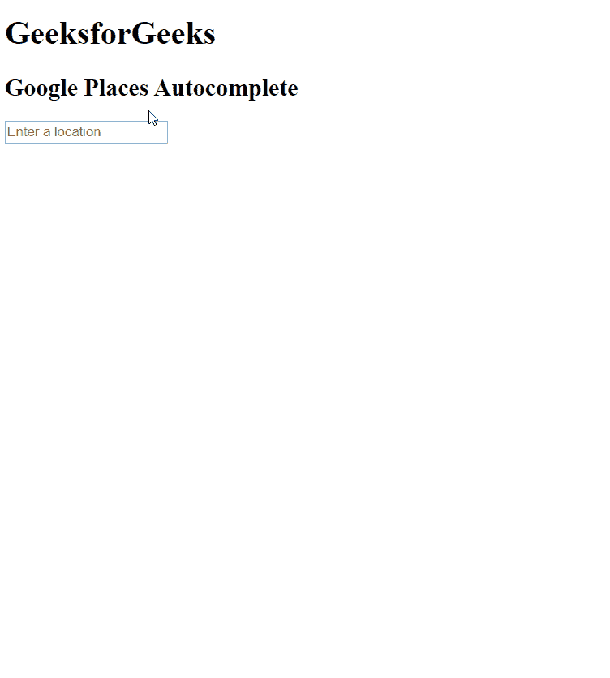

# 如何将谷歌位置自动完成功能添加到您的角度应用中？

> 原文:[https://www . geeksforgeeks . org/如何添加-谷歌-位置-自动完成到您的角度-应用/](https://www.geeksforgeeks.org/how-to-add-google-locations-autocomplete-to-your-angular-application/)

这里的任务是将**谷歌位置自动完成**添加到您的角度应用程序中。当用户在文本字段中输入某个位置的文本时，他/她将获得位置推荐，并可以自动完成该位置。为了达到目标，我们将使用**ngx-Google-places-autocomplete**角度包。

#### 什么是**ngx-Google-places-自动完成**？

这个模块是 Google Places 自动完成 js 库的包装器。它允许我们将位置自动完成集成到我们的项目中。

### 接近

*   首先安装**ngx-Google-places-自动完成**到你的角度项目>

**对于 npm:**

```ts
npm install ngx-google-places-autocomplete
```

**纱线:**

```ts
yarn add ngx-google-places-autocomplete
```

*   在项目应用程序的 src 中将库添加到您的 index.html。

*   生成一个应用编程接口密钥，并将上面脚本标签中的**应用编程接口密钥**放置在 **<您的应用编程接口密钥>的位置。**
*   要生成应用编程接口密钥，请遵循以下步骤:
    *   转到[https://developers . Google . com/places/web-service/get-api-key](https://developers.google.com/places/web-service/get-api-key)并按照所有步骤创建一个 API 密钥。
    *   为您的应用编程接口密钥启用位置应用编程接口。
    *   确保您的应用编程接口已启用，要启用您的应用编程接口，请按照此链接[https://support.google.com/googleapi/answer/6158841?hl=en](https://support.google.com/googleapi/answer/6158841?hl=en)中的步骤操作。
*   在 app.module.ts 中进行必要的 GooglePlaceModule 导入。

```ts
import { GooglePlaceModule } from "ngx-google-places-autocomplete";

@NgModule({

  imports: [
    GooglePlaceModule
  ],
```

*   在 appcomponent 的 **HTML** 文件中。为输入字段定义代码，在该输入字段中，用户定义函数 AddressChange()将由传递$event 的 **(onAddressChange)调用，选项将处理组件. ts 文件的国家数组中的国家设置。**
*   在 **component.ts** 文件中，用户自定义函数从$event address 中获取**格式的 _address，然后使用该地址通过插值绑定来设置输入字段中的地址。**

**注:**国家阵中有“AU”为澳大利亚添加，可以根据自己添加其他任何国家。

### 实施:

**app.module.ts**

## java 描述语言

```ts
import { BrowserModule } from '@angular/platform-browser';
import { NgModule } from '@angular/core';
import { RouterModule } from '@angular/router';
import { AppComponent } from './app.component';
import '@angular/compiler';
//import for GooglePlaceModule
import { GooglePlaceModule } from "ngx-google-places-autocomplete";

@NgModule({
  declarations: [
    AppComponent,
  ],
  imports: [
    BrowserModule,
    //Adding to imports
    GooglePlaceModule
  ],
  providers: [],
  bootstrap: [AppComponent]
})
export class AppModule { }
```

**app.component.html**

## 超文本标记语言

```ts
<div class="container">
    <h1>GeeksforGeeks</h1>
    <h2>Google Places Autocomplete</h2>
<input ngx-google-places-autocomplete [options]=
   'options'  (onAddressChange)="AddressChange($event)"/>
{{ formattedaddress }}
</div>
```

**app.component.ts**

## java 描述语言

```ts
import { Component } from '@angular/core';

@Component({
  selector: 'app-root',
  templateUrl: './app.component.html',
  styleUrls: ['./app.component.css']
})
export class AppComponent {
  title = 'rou';
  //Local Variable defined
  formattedaddress=" ";
  options={
    componentRestrictions:{
      country:["AU"]
    }
  }
  public AddressChange(address: any) {
  //setting address from API to local variable
   this.formattedaddress=address.formatted_address
}
}
```

### 输出:

使用 ng serve 运行开发服务器，并在输入字段中写入一些位置，以查看自动完成位置。

